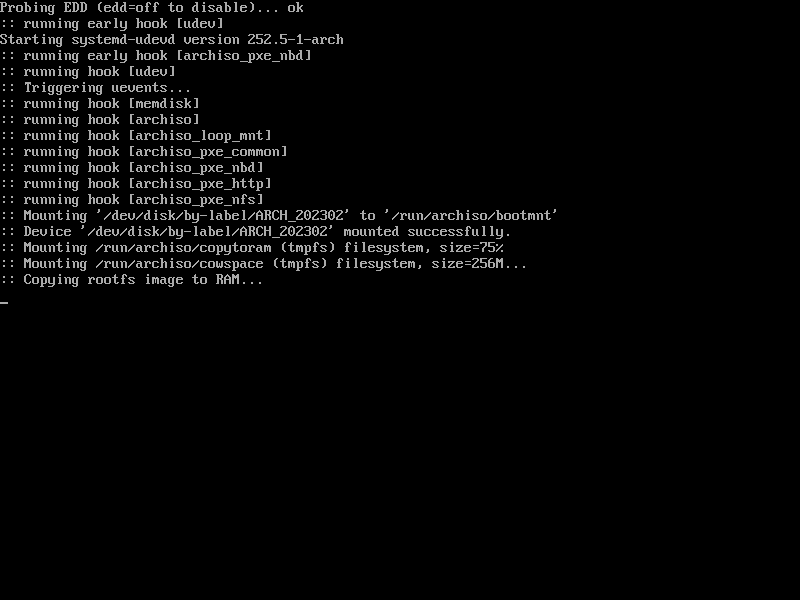
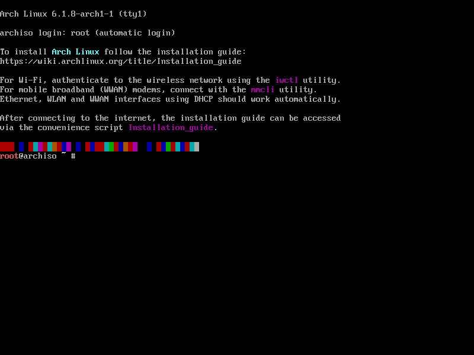
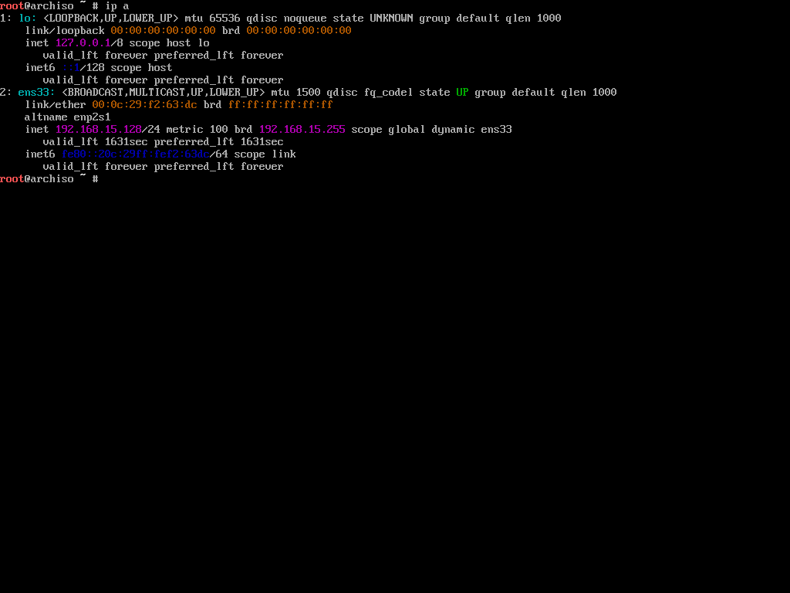
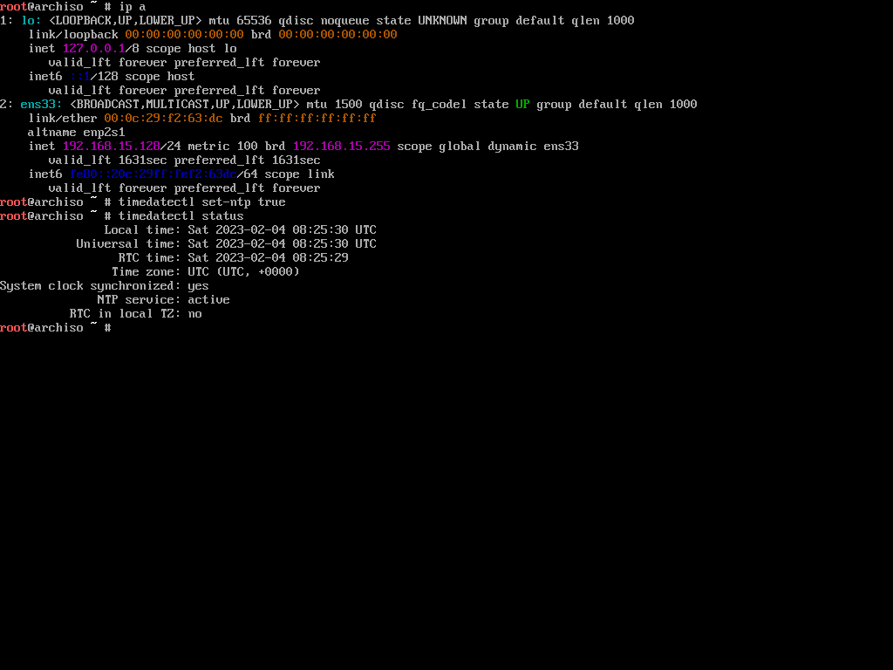
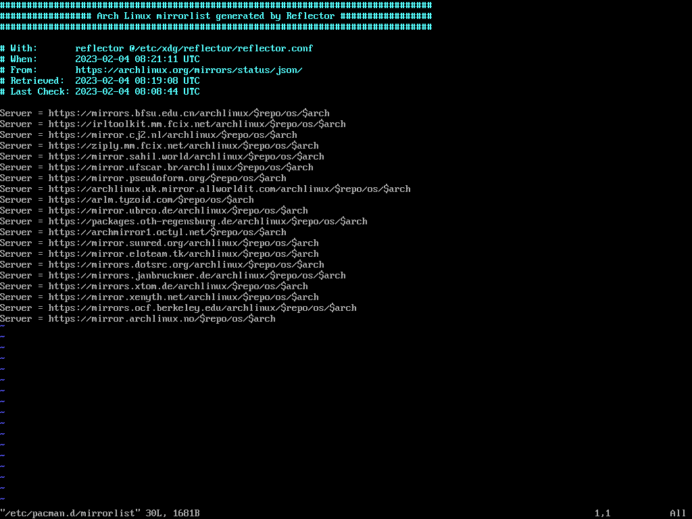

# arch 系统安装 BIOS

## 虚拟机安装

### 虚拟机安装步骤

#### 1. 选择安装方式

- 进入系统

  /images/arch-0204-2023-02-04-21-00-09.png)
  

- 等待一段时间后，进入系统

  

#### 2. 禁用reflector服务（可选）

```shell
systemctl stop reflector.service
systemctl status reflector.service
```

#### 3. 验证引导模式

```shell
ls /sys/firmware/efi/efivars
# 如果显示了相关目录，则系统以UEFI模式引导，如果目录不存在，则系统以BIOS模式引导
```

#### 4. 连接网络

- 虚拟机已经默认配置好网络
 

- 使用无线连接

  ```shell
  iwctl # 进入交互式命令行
  device list # 列出无线网卡设备名，比如无线网卡看到叫 wlan0
  station wlan0 scan # 扫描网络
  station wlan0 get-networks # 列出所有 wifi 网络
  station wlan0 connect wifi-name # 进行连接，注意这里无法输入中文。回车后输入密码即可
  exit # 连接成功后退出
  ```

#### 5. 系统配置

##### 5.1 更新系统时钟

  ```shell
  timedatectl set-ntp true # 系统时间与网络时间同步
  timedatectl status # 检查服务状态
  ```

  

##### 5.2 更换国内软件仓库镜像源

  ```shell
  vim /etc/pacman.d/mirrorlist
  ```

  

##### 5.3 分区和格式化

- 创建硬盘分区

  ```shell
  fdisk -l
  
  lsblk
  
  fdisk /dev/sda
  
  n
  
  ```

- 格式化分区

  ```shell
  mkfs.ext4 /dev/root_partition（根分区）
  mkswap /dev/swap_partition（交换空间分区）
  ```
  
- 挂载分区

  ```shell
  mount /dev/root_partition（根分区） /mnt
  
  swapon /dev/swap_partition（交换空间分区）
  ```

#### 6.安装系统

- 使用 `pacstrap` 脚本安装基础包

  ```shell
  pacstrap -K /mnt base linux linux-firmware
  # 如果使用btrfs文件系统，额外安装一个btrfs-progs包
  
  pacstrap /mnt dhcpcd iwd vim sudo zsh zsh-completions
  ```
  
#### 7.配置系统

- Fstab

  ```shell
  genfstab -U /mnt > /mnt/etc/fstab
  
  cat /mnt/etc/fstab
  ```

- arch-chroot

  ```shell
  arch-chroot /mnt
  ```

- 时区

  ```shell
  ln -sf /usr/share/zoneinfo/Asia/Shanghai /etc/localtime
  
  hwclock --systohc
  ```

- 本地化

  ```shell
  vim /etc/locale.gen
  # 取消注释
  en_US UTF-8 UTF-8
  zh_CN UTF-8 UTF-8
  
  
  locale-gen
  
  echo 'LANG=en_US.UTF-8'  > /etc/locale.conf
  ```

- 设置主机名

  ```shell
  vim /etc/hostname
  ```

- root密码

  ```shell
  passwd
  ```

- 安装微码

  ```shell
  pacman -S intel-ucode # Intel
  pacman -S amd-ucode # AMD
  ```

- 安装引导程序

  ```shell
  pacman -S grub
  
  # grub-install /dev/sda
  
  grub-mkconfig -o /boot/grub/grub.cfg
  ```

- 完成安装

  ```shell
  exit # 退回安装环境
  umount -R /mnt # 卸载新分区
  reboot # 重启
  ```

- 配置系统

```bash
systemctl enable --now dhcpcd 
```
