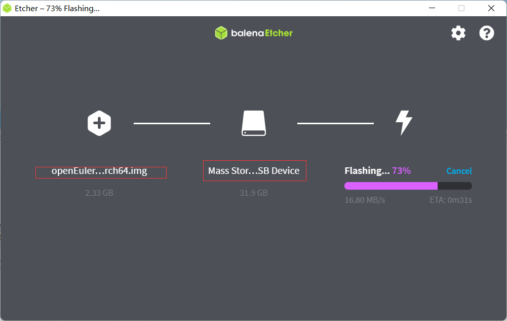

# 树莓派安装openeuler 系统

## 准备工作

1. openeuler系统镜像 [树莓派openeuler镜像](https://repo.openeuler.org/openEuler-22.03-LTS/raspi_img/openEuler-22.03-LTS-raspi-aarch64.img.xz)

2. 将系统写入SD卡 [balenaElcher](https://www.balena.io/etcher/)

## 步骤

### 系统写入SD卡中

1. 打开balenaElcher，选中下载的openeuler镜像，然后选择要写入的SD卡，点击确认开始执行

   

### 配置系统

#### 配置WiFi

```shell
# 查看当前可访问热点
nmcli dev wifi list

[root@openEuler ~]# nmcli dev wifi list
IN-USE  BSSID              SSID            MODE   CHAN  RATE        SIGNAL  BARS  SECURITY
        B0:DF:C1:A9:B6:78  Tenda_A9B678    Infra  4     130 Mbit/s  100     ▂▄▆█  WPA1 WPA2
        5C:02:14:94:97:8A  Xiaomi_87D8     Infra  6     130 Mbit/s  100     ▂▄▆█  WPA2
        BC:13:A8:8D:27:C3  CU_2.4G_27BE    Infra  6     130 Mbit/s  100     ▂▄▆█  WPA1 WPA2
        62:02:14:94:97:8A  --              Infra  6     130 Mbit/s  100     ▂▄▆█  --
        5C:02:14:94:97:89  Xiaomi_87D8     Infra  36    270 Mbit/s  100     ▂▄▆█  WPA2
        34:96:72:D0:28:BF  TP-LINK_28BF    Infra  1     270 Mbit/s  75      ▂▄▆_  WPA1 WPA2
        08:40:F3:D3:BF:41  Tenda_神.月读   Infra  2     130 Mbit/s  69      ▂▄▆_  WPA1 WPA2
        7C:B5:9B:33:60:A6  TP-LINK_60A6    Infra  11    270 Mbit/s  67      ▂▄▆_  WPA1 WPA2
        7E:B5:9B:13:60:A6  TP-LINK_E46E    Infra  11    270 Mbit/s  64      ▂▄▆_  WPA1 WPA2
        48:7D:2E:99:E8:D3  zyfnet          Infra  11    405 Mbit/s  62      ▂▄▆_  WPA1 WPA2
        EC:C0:1B:E1:F4:50  CU_d5Tx         Infra  10    130 Mbit/s  60      ▂▄▆_  WPA2
        42:F6:2E:1F:D3:C2  zf              Infra  13    270 Mbit/s  59      ▂▄▆_  WPA2
        3C:46:D8:BA:F2:0C  TP-LINK_BAF20C  Infra  6     270 Mbit/s  52      ▂▄__  WPA1 WPA2
        82:25:2C:8A:03:C2  wkw             Infra  1     270 Mbit/s  49      ▂▄__  WPA2
        A2:5D:84:65:7A:47  Chang-He        Infra  6     270 Mbit/s  49      ▂▄__  WPA2
        EC:C0:1B:E1:F4:54  CU_d5Tx_5G      Infra  36    270 Mbit/s  44      ▂▄__  WPA1 WPA2
        8C:5A:C1:B8:33:AC  WT134           Infra  6     270 Mbit/s  42      ▂▄__  WPA2
        
# 连接WiFi
nmcli device wifi connect Xiaomi_87D8 password 'zhengzongwei520'
nmcli --ask device wifi connect Xiaomi_87D8

[root@openEuler ~]# nmcli device wifi connect Xiaomi_87D8 password 'zhengzongwei520'
Device 'wlan0' successfully activated with '9c711295-efe2-444a-adc2-de2071503dab'.
[root@openEuler ~]# nmcli --ask device wifi connect Xiaomi_87D8
Password: •••••••••••••••
Device 'wlan0' successfully activated with '9c711295-efe2-444a-adc2-de2071503dab'.
[root@openEuler ~]#

# 显示当前连接
nmcli connection show 
```
