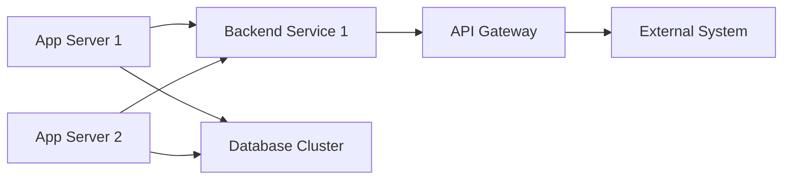

```bash
git config --global user.name "zhengzongwei"
git config --global user.email zhengzongwei@foxmail.com

git config --local user.name "w_zhengzongwei"
git config --local user.email w_zhengzongwei@kingsoft.com
```




