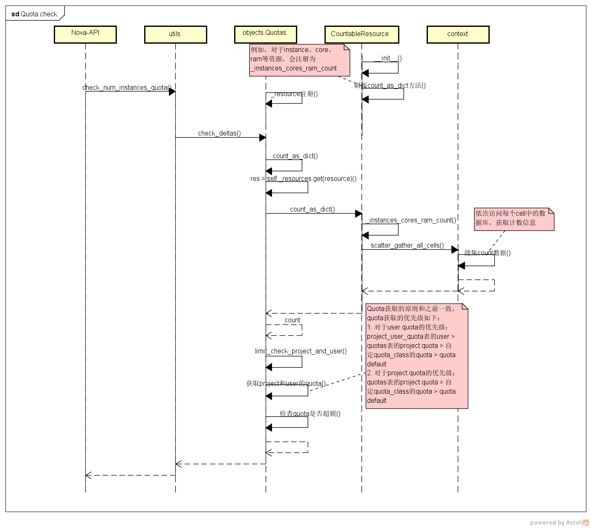

# nova 创建虚拟机流程解析

## 概述

Nova是OpenStack中处理计算业务（虚拟机、裸机、容器）的组件，整体的虚拟机创建是学习和熟悉Nova组件的第一步。本篇文章主要是基于OpenStack Pike版本，基于最新的Cell v2架构部署为例，来介绍虚拟机的创建流程，并分析Pike等最近几个版本中，虚拟机创建流程的关键变化。

## 虚拟机创建流程

```mermaid
sequenceDiagram
autonumber
participant User
participant Nova-API
participant Conductor
participant Nova-Scheduler
participant Nova-Placement
participant Nova-Compute
participant Cinder
participant Neutron
participant Glance

User ->> Nova-API: 1. 创建虚拟机
Nova-API ->> Nova-API: 1.1 参数校验
Nova-API ->> Glance: 2. 获取镜像信息
Nova-API ->> Nova-API: 1.2 provision_instalnce()
Note right of Nova-API: vm-state BUILDING <br>task_stats SCHEDULING
Nova-API ->> Nova-API: 1.2.1 quota校验
Nova-API ->> Nova-API: 1.2.2 创建DB数据
Nova-API ->> Nova-API: 1.2.3 添加Group()
Nova-API -->> Nova-API: instance_to_build
Nova-API -->> User: return 202 虚拟机信息
Nova-API ->> Conductor: 3. Schedule & Build()
Conductor ->> Nova-Scheduler: 3.1 select_destination()
Nova-Scheduler ->> Nova-Placement: 3.1.1 Get allocation candidates()
Nova-Placement -->> Nova-Scheduler: alloc reqs, provider_summaries
Nova-Scheduler ->> Nova-Scheduler: 3.1.2 Filter & Weigher()
Nova-Scheduler ->> Nova-Placement: 3.1.3 Claim Resources()
Nova-Placement -->> Nova-Scheduler: 
Nova-Scheduler -->> Conductor: return host
Conductor ->> Conductor: 4. 虚拟机DB创建（in target cell）
Conductor ->> Conductor: 5. Quota校验(recheck)
Conductor ->> Conductor: 6. 刷新instance cell信息
Conductor ->> Conductor: 7. 删除build_request()
Conductor ->> Nova-Compute: 8. 构建虚拟机(在指定cell)
Note left of Nova-Compute: vm_states.BUILDING <br> task_states.None
Nova-Compute ->> Neutron: 8.1. 创建网络🛜
Note left of Neutron: vm_sates.BUILDING <br> task_states.NETWORKING
Nova-Compute ->> Cinder: 9. 构建块设备
Note left of Cinder: vm_sates.BUILDING <br> task_states.BLOCK_DEVICE_MAPPING
Nova-Compute ->> Nova-Compute: 10. driver.spawn()
Note left of Nova-Compute: vm_sates.BUILDING <br> task_states.SPAWNING
Nova-Compute ->> Glance: 10.1. 下载镜像
Nova-Compute ->> Nova-Compute: 10.2. 生成xml,扫盘，配置网络
Nova-Compute ->> Nova-Compute: 11. 刷新虚拟机状态
Note left of Nova-Compute: vm_sates.BUILDING <br> task_states.None
```

上图是虚拟机创建的整体流程，可以看到虚拟机创建一次经过了API、Conductor、Scheduler、Placement、Compute等服务。

### Nova-API

在OpenStack的组件中，基本每一个组件都会有一个API服务，对于Nova来说API服务主要的作用就是接收由用户通过Client或者其他REST请求工具（curl、postman）发送的请求。

在虚拟机的创建流程中，API就相当于Nova的入口，当API接收到请求后，主要会处理一些关于参数校验、配额检测等事物、

#### 参数校验

```bash
nova --debug boot --image 81e58b1a-4732-4255-b4f8-c844430485d2 --flavor 1 zzw-test
```

我们通过`--debug`来开启debug模式，来看看命令行究竟做了什么事，可以从回显中，看到一个关键的信息：

> curl -g -i -X POST <http://xxx.xxx.xxx.xxx/compute/v2.1/servers> -H “Accept: application/json” -H “User-Agent: python-novaclient” -H “OpenStack-API-Version: compute 2.53” -H “X-OpenStack-Nova-API-Version: 2.53” -H “X-Auth-Token: $token” -H “Content-Type: application/json” -d **‘{“server”: {“name”: “zzw-test”, “imageRef”: “81e58b1a-4732-4255-b4f8-c844430485d2”, “flavorRef”: “1”, “max_count”: 1, “min_count”: 1, “networks”: “auto”}}’**

我们可以看到虚拟机创建时，传入了一些诸如虚拟机名称、镜像、规格、个数、网络等基本信息。在API中，首先就会对这些参数进行校验，比如镜像ID是否合法、网络是否正确等。

#### 配额检测

值得一提的是，在Pike版本的虚拟机创建开始时，对配额检测进行了优化。

我先看看之前的实现，在之前版本的Nova中，Quota检测过程相对来说比较复杂，首先会进行reserve操作，对资源进行预占，然后预占成功，并且创建成功后，最终会进行commit操作。然而，为了保证在并发的场景下，不会对超过用户配额（这都是钱啊！），因此在reserve和commit进行资源更新的时候都会quota相关的数据表的用户相关行加把锁，也就是说更新quota记录的时候，一个用户去更新时，其他用户再想刷新只能等着，直到前一个用户完成数据库记录刷新为止，这样就大大降低的效率，并发的性能也就不是很客观了。

另外，由于需要对cell v2进行支持，目前所有的quota表均已移动到API的数据库了可以参考BP[CellsV2 - Move quota tables to API database](https://specs.openstack.org/openstack/nova-specs/specs/ocata/approved/cells-quota-api-db.html)。Cell V2的设计思想是，由API、Super Conductor去访问上层的全局数据库（nova_api数据库），而底下的cell中的组件，只需要关心cell中的逻辑即可。因此，为了彻底的解耦，让cell中的compute无需再访问api数据库进行诸如commit操作，在Pike版本，社区对quota机制进行了优化，详情可以参考[Count resources to check quota in API for cells](https://specs.openstack.org/openstack/nova-specs/specs/pike/approved/cells-count-resources-to-check-quota-in-api.html)这个BP。

因此Pike版本之后，配额检测变成了这样：

1. 首先，api中进行第一次Quota检测，主要方法就是收集地下各个cell数据库中的资源信息，然后和api数据库中的quota上限进行对比。例如，一个用户可以创建10个虚拟机，在cell1中有2个，cell2中有7个，再创建一个虚拟机时，会搜集cell1和cell2中的虚拟机个数之和（9个），然后加上变化（新增一个），与总配额进行比较。

2. 二次检测（cell v2在super conductor里做）。由于在并发场景下，可能出现同时检测发现满足，之后进行创建，就会造成配额的超分，针对这个问题，社区目前给出的方案是，在创建虚拟机记录之后，再进行recheck，如果发现超额了，会将超额分配的虚拟机标记为ERROR，不再继续往下走了。

   每次检测的逻辑都调用相同的函数，具体逻辑如下图所示：

   

   ```mermaid
   sequenceDiagram
   
   participant Nova-API
   participant utils
   participant object Quotas
   participant CountableResource
   participant context
   ```

### Nova Super Conductor

Super Conductor在创建虚拟机的流程其实和之前差不多，选个合适的节点（调度），然后，写入虚拟机相关的记录，然后，投递消息到选定的Compute节点进行虚拟机的创建。

在Cell v2场景，虚拟机的创建记录已经需要写入的子cell中，因此，conductor需要做的事，包括一下几个步骤：

1. 进行调度，选出host。
2. 根据host，通过**host_mappings**找到对应的cell
3. 在对应的cell db中创建虚拟机记录，并且记录**instances_mappings**信息
4. 通过cell_mappings来查找对应的cell的mq，然后投递到对应的cell中的compute

完成这些操作时，需要牵扯到3个关键的数据结构，我们来简单的看一下：

- host_mappings：记录了host和cell的映射信息
- instances_mappings：记录了虚拟机和cell的映射信息
- cell_mappings：记录了cell和cell对应的mq的映射信息

与Cell v1不太相同，在目前的设计中，认为scheduler能看到的应该是底下能够提供资源的具体的所有的Resource Provider（对于计算资源来说，就是所有的计算节点），而不是整个cell，也就是说所有cell中的资源scheduler都可以看到，而子cell就负责创建就好了。因此，在super conductor中，需要做一些transfer的事情，这样也就不必在像cell v1那样，在子cell里还得搞个scheduler去做调度。

### Nova-Scheduler

刚才我们在conductor中，已经介绍了，在选择具体哪个节点来创建虚拟机时，调用了Scheduler的select_destination方法，在之前的版本的调度中，就是OpenStack最经典的Filter&Weight的调度，已经有大量的资料介绍过具体的实现和用法。可以参考官方文档[Filter Scheduler](https://docs.openstack.org/nova/latest/user/filter-scheduler.html)。

在Pike版本中，在调度这部分还是做了比较大的调度，主要就是2个相关变动。

1. 通过Placement获取可用的备选资源，参考[Placement Allocation Requests](https://specs.openstack.org/openstack/nova-specs/specs/pike/approved/placement-allocation-requests.html)的实现。
   在Ocata版本时，[Resource Providers - Scheduler Filters in DB](https://specs.openstack.org/openstack/nova-specs/specs/ocata/implemented/resource-providers-scheduler-db-filters.html)这个BP就已经在调度前加了一步，获取备选节点。从BP的标题就可以看出，设计者想通过Placement服务提供的新的一套机制，来做过滤。原因是之前的调度需要在scheduler维护每一个compute节点的hoststate信息，然后调度的时候，再一个个去查，这太低效了，尤其是在计算节点数目比较多的时候。因此，增加了一个“预过滤”的流程，通过向Placement查询，Placement服务直接通过SQL去查一把，把满足条件（比如CPU充足、RAM充足等）先获取到。
   而原来获取备选节点的时候，只支持获取单一的Resource Provider，这个BP增强了获取备选资源的能力，用于后续支持更复杂的请求，比如共享资源、嵌套资源的Provider查询。后面，Placement还会陆续支持更多的请求，比如对一些非存量不可计数的资源的支持。这样留给后面Filter&Weight的压力就小一些了，再往后，会不会完全取代Filter呢？我想，现有的各种过滤都可以通过Placement支持后，完全有可能的。
2. Scheduler通过Placement来claim资源。参考[Scheduler claiming resources to the Placement API](https://blueprints.launchpad.net/nova/+spec/placement-claims)的实现。
   在最早的时候，claim资源是由compute来做的，现在相当于提前到scheduler去搞了。有什么好处呢？我们先看看原来的问题：
   调度时刻和真正的去compute节点去claim资源的时刻之间是由一段时间的，在资源不是那么充足的环境，就会造成在scheduler调度的时候，资源还没刷新，所以调度时候成功了，但是真正下来的时候，才发现compute实际已经没有资源了，然后又“跨越半个地球”去做重调度，无形地增加了系统的负载。
   而且增加了创建的时长（哦，哪怕创建失败呢？），你想想，用户创了那么久的虚拟机，最后你告诉我调度失败了，用户不太能忍。
   所以这个BP就把Claim资源放在调度处了，我上一个调度请求处理完，马上就告诉placement，这资源老子用了，其他人不要动了。OK，世界终于清净了，能拿到资源的拿到了，拿不到资源的马上也知道自己拿不到了，大大增强了调度的用户体验。

### Placement

在虚拟机创建的流程中，比较常用的接口就是获取备选资源和claim资源。Placement目标很宏伟，大致的作用就是：资源我来管，要资源问我要，用了资源告诉我。

### Nova-Compute

这个里面依旧还是做那么几件事，挂卷，挂网卡，调driver的接口启动一下虚拟机。至此，虚拟机就起来了。

## 总结

整体的看一下，其实在Pike版本，Nova还是有很多的变动。真的是一个版本过去了，创建虚拟机的流程已经面目全非了。

从P版本的虚拟机创建流程来看，主要的优化集中在基于Cell V2架构下的多cell支持、调度的优化、Quota的优化，而后续的发展，目前也是集中在Placement各种资源的支持以及在Cell v2场景的诸如基本流程、调度等的优化。
