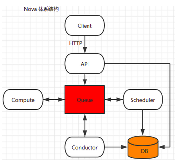
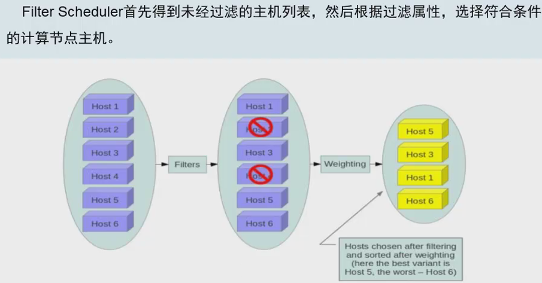
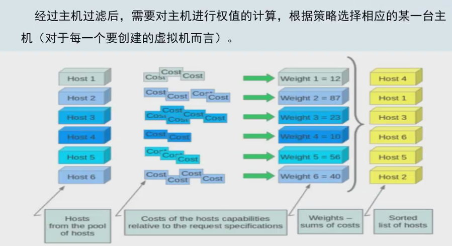
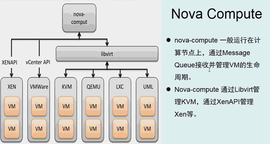
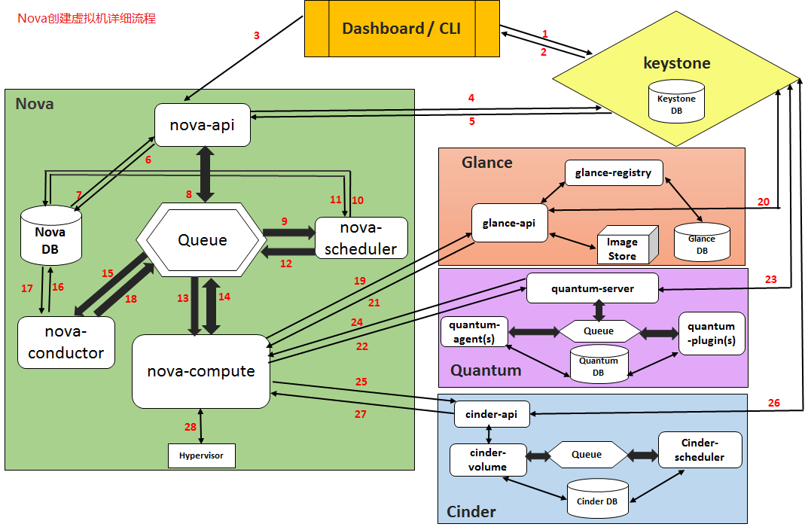
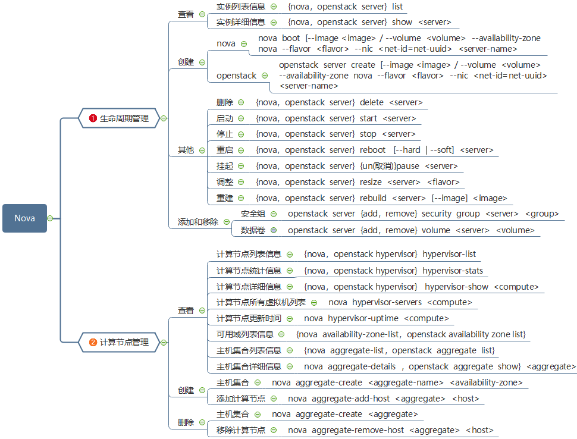

# Openstack Nova

## 简介

### 概念

1. Nova和Swift是OpenStack最早的两个组件，nova分为控制节点和计算节点
2. 计算节点通过Nova Computer进行虚拟机创建，通过libvirt调用kvm创建虚拟机，nova之间通信通过rabbitMQ队列进行通信
3. Nova位于Openstack架构的中心，其他服务或者组件（比如Glance、Cinder、Neutron等）对它提供支持，另外它本身的架构也比较复杂

### 作用

1. Nova是OpenStack最核心的服务模块，负责管理和维护云计算环境的计算资源，负责整个云环境虚拟机生命周期的管理
2. Nova是OpenStack的计算服务，负责维护和管理的网络和存储，提供计算服务

### 体系结构

## 组件

1. nova-api

   实现了RESTful API功能，是外部访问nova的唯一途径，接受外部的请求并通过Message Queue将请求发送给其他的服务组件，同时兼容EC2 API，所以也可以用EC2的管理工具对nova进行管理

2. nova-scheduler

   决策虚拟机创建在那个节点上。决策一个虚拟机应该调度到某个物理节点，需要分为两个步骤

   - 过滤（filter）：过滤出可以创建虚拟机的主机

     

   - 计算权值（weight）：根据权重大小进行分配，默认根据资源可用空间进行权重排序

     

3. nova-compute

   负责虚拟机的生命周期管理，创建并终止虚拟机实例的工作后台程序hypervisor api

   

4. nova-conductor

   计算节点访问数据的中间件，nova-compute服务和数据库之间的中间件。它消除了对云数据库的直接访问

5. nova-api-metadata

   从实例中接收元数据请求。nova-api-metadata服务通常在nova-network安装时使用的是多宿主模式运行

6. nova-placement-api

   跟踪每个计算提供者的仓库和使用情况

7. nova-consoleauth

   用于控制台的授权验证，授权控制台代理提供的用户令牌。此服务必须运行用于控制台代理工作。您可以运行任何类型的代理，而不是集群配置中的单nova-consoleauth服务

8. queue

   在守护进程之间传递消息的中心。通常使用RabbitMQ也可以用另一个基于AMQP的消息队列，例如ZeroMQ

   |                  |                                                              |
   | ---------------- | ------------------------------------------------------------ |
   | nova-api         | 管理者可以通过这个交互接口来管理内部基础设施和为用户提供服务，向消息队列发送消息，达到资源调度的功能 |
   | nova-conductor   | 负责数据库的访问权限控制，避免nova- compute直接访问数据库，更好的安全性和伸缩性 |
   | nova-scheduler   | 虚拟机调度服务，现通过过滤器（Filter）选择满足条件的计算节点（运行nova- compute），然后通过权重计算（Weight）选择最优的计算节点创建虚拟机 |
   | nova-compute     | 运行在计算节点，通过接收消息队列的请求来处理和管理实例生命周期 |
   | nova-network     | 系统内部的路由，承担了IP地址的划分以及配置VLAN和安全组的划分 |
   | queue            | 提供了一个守护进程（各个模块）之间的传递消息的中央枢纽       |
   | nova-console     | 为用户提供控制台访问                                         |
   | nova-consoleauth | 负责对访问虚拟机控制台请求提供Token认证                      |
   | nova-cert        | 提供x509证书支持                                             |

## 工作流程

1. 界面或命令行通过RESTful API向keystone获取认证信息。
2. keystone通过用户请求认证信息，正确后生成token返回给对应的认证请求。
3. 界面或命令行通过RESTful API向nova-api发送一个创建虚拟机的请求（携带token）。
4. nova-api接受请求后向keystone发送认证请求，查看token是否为有效用户。
5. keystone验证token是否有效，如有效则返回有效的认证和对应的角色（注：有些操作需要有角色权限才能操作）。
6. 通过认证后nova-api检查创建虚拟机参数是否有效合法后和数据库通讯。
7. 当所有的参数有效后初始化新建虚拟机的数据库记录。
8. nova-api通过rpc.call向nova-scheduler请求是否有创建虚拟机的资源(Host ID)。
9. nova-scheduler进程侦听消息队列，获取nova-api的请求。
10. nova-scheduler通过查询nova数据库中计算资源的情况，并通过调度算法计算符合虚拟机创建需要的主机。
11. 对于有符合虚拟机创建的主机，nova-scheduler更新数据库中虚拟机对应的物理主机信息。
12. nova-scheduler通过rpc.cast向nova-compute发送对应的创建虚拟机请求的消息。
13. nova-compute会从对应的消息队列中获取创建虚拟机请求的消息。
14. nova-compute通过rpc.call向nova-conductor请求获取虚拟机消息。
15. nova-conductor从消息队队列中拿到nova-compute请求消息。
16. nova-conductor根据消息查询虚拟机对应的信息。
17. nova-conductor从数据库中获得虚拟机对应信息。
18. nova-conductor把虚拟机信息通过消息的方式发送到消息队列中。
19. nova-compute从对应的消息队列中获取虚拟机信息消息。
20. nova-compute通过keystone的RESTfull API拿到认证的token，并通过HTTP请求glance-api获取创建虚拟机所需要镜像
21. glance-api向keystone认证token是否有效，并返回验证结果。
22. token验证通过，nova-compute获得虚拟机镜像信息(URL)。
23. nova-compute通过keystone的RESTfull API拿到认证k的token，并通过HTTP请求neutron-server获取创建虚拟机所需要的网络信息。
24. neutron-server向keystone认证token是否有效，并返回验证结果。
25. token验证通过，nova-compute获得虚拟机网络信息。
26. nova-compute通过keystone的RESTfull API拿到认证的token，并通过HTTP请求cinder-api获取创建虚拟机所需要的持久化存储信息。
27. cinder-api向keystone认证token是否有效，并返回验证结果。
28. token验证通过，nova-compute获得虚拟机持久化存储信息。
29. nova-compute根据instance的信息调用配置的虚拟化驱动来创建虚拟机。

## 常用操作

### 生命周期和虚拟机管理

### 云主机类型和安全组管理

### 网络、浮动IP、密匙和配额管理

