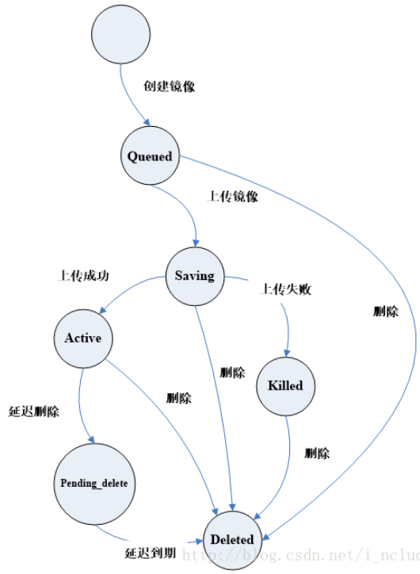
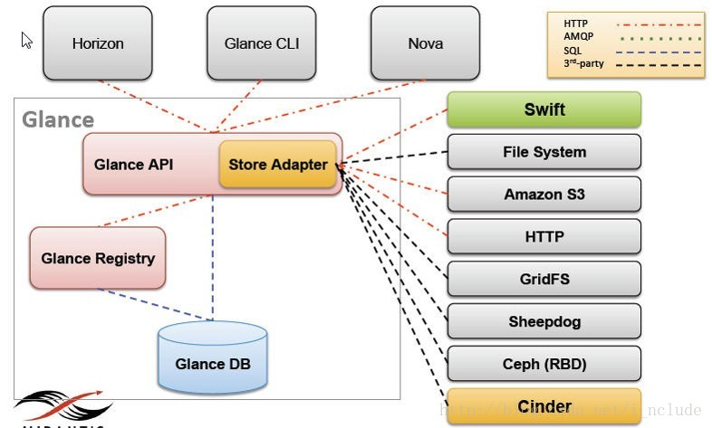
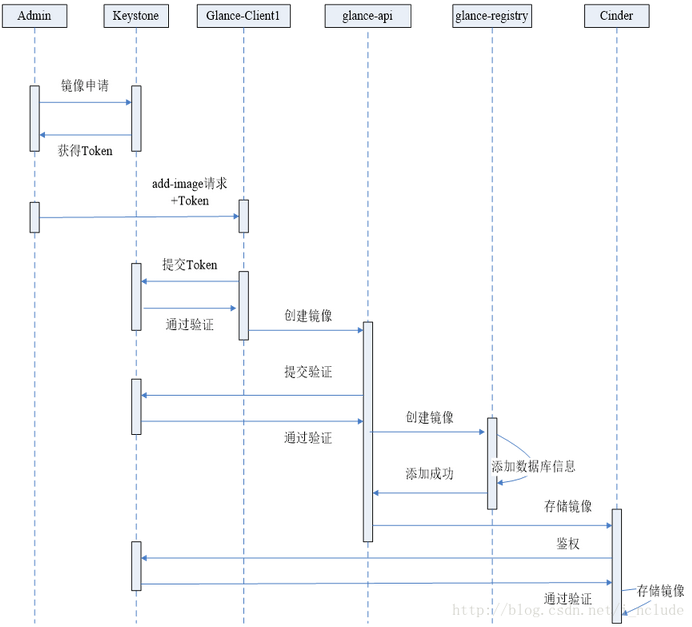
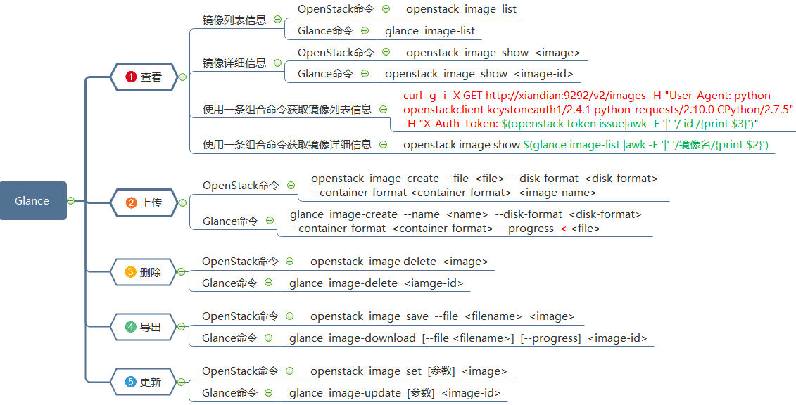

# Openstack Glance

## 简介

1. Glance是open stack的镜像服务，用来注册、登陆、和检索虚拟机镜像
2. Glance服务提供一个RESTful API ，使你能够查询虚拟机镜像元数据和检索的实际镜像
3. 通过镜像服务提供的虚拟机镜像可以存储在不同的位置，从简单的文件系统对象存储和类似open stack对象存储系统
4. 提供对虚拟机部署的时候所能提供的镜像的管理，包含镜像的导入，格式，以及制作相应的模板

### 镜像状态

1. Queued

   初始化镜像状态，在镜像文件刚刚被创建，在glance数据库中已经保存了镜像标识符，但是还没有上传到glance中，此时的glance对镜像数据没有任何描述，其存储空间为0

2. Saving

   镜像的原始数据在上传中的一种过渡状态，它产生在镜像数据上传至glance的过程中，一般来说，glance收到一个image请求后，才将镜像上传给glance

3. Active：镜像上传完成以后的一种状态，表明glance中可用的镜像

4. Killed：镜像上传失败或者镜像文件不可读的情况下，glance将镜像状态设置成Killed

5. Deleted：镜像文件马上会被删除，只是当前glance这种仍然保留该镜像文件的相关信息和原始镜像数据

6. Pending_delete：镜像文件马上会被删除，镜像文件不能恢复

   

### 磁盘格式

1. RAW

   RAW即常说的裸格式，它其实就是没有格式，最大的特点就是简单，数据写入什么就是什么，不做任何修饰，所以再性能方面很不错，甚至不需要启动这个镜像的虚拟机，只需要文件挂载即可直接读写内部数据。并且由于RAW格式简单，因此RAW和其他格式之间的转换也更容易。在KVM的虚拟化环境下，有很多使用RAW格式的虚拟机

2. QCOW2

   QEMU的CopyOn Write特性的磁盘格式，主要特性是磁盘文件大小可以随着数据的增长而增长。譬如创建一个10GB的虚拟机，实际虚拟机内部只用了5GB，那么初始的qcow2磁盘文件大小就是5GB。与RAW相比，使用这种格式可以节省一部分空间资源

3. VHD

   VHD也是一种通用的磁盘格式。微软公司的Virtual PC和Hyper-V使用的就是VHD格式。VirtualBox也提供了对VHD的支持。如果要在OpenStack上使用Hyper-V的虚拟化，就应该上传VHD格式的镜像文件

4. VMDK

   VMware创建的一个虚拟机磁盘格式，目前也是一个开放的通用格式，除了VMware自家的产品外，QEMU和VirtualBox也提供了对VMDK格式的支持

5. VDI

   Oracle公司的VirtualBox虚拟软件所使用的格式

6. ISO

   ISO是指一种存档数据文件在光盘上的格式

7. AKI、ARI、AMI

   Amazon公司的AWS所使用的镜像格式

### 容器格式

1. BARE

   没有容器的一种镜像元数据格式

2. OVF

   开放虚拟化格式

3. OVA

   开放虚拟化设备格式

4. AKI、ARI

   Amazon公司的AWS所使用的镜像格式

## 架构

### 核心架构

1. Glance-API

   接收REST API的请求，然后通过其他模块（glance-registry及image store）来完成诸如镜像的查找、获取、上传、删除等操作，默认监听9292端口

2. Glance-registry

   用于与数据库交互，用于存储或获取镜像的元数据，默认监听端口 9191

3. Store Adapter

   通过提供的存储接口来获取镜像

4. Database

   image的metadata会保持到database中，主要是用MySQL和SQ Lite

## 配置文件

1. Glance-api.conf

   - Glance服务安装的日志和调试信息，例如：debug、日志文件路径log_file等参数

   - Glance服务的API服务器的相关信息。例如：服务绑定的IP地址、端口bind_port等参数
   - Registry服务的相关信息，例如：Registry服务的网络地址、监听的端口号、glance与Registry间通信的协议等
   - 系统消息相关参数，该部分主要配置glance与系统消息的收发。消息队列rabbitmq的IP地址、监听端口等参数
   - 镜像后端存储的相关配置，一般情况下，glance-api.config中包含普通文件存储、swift、S3、RBD等较为常见的存储设备的信息配置。

2. Glance-registry.conf

   Glance registry服务配置文件，用户存储镜像有关的元数据

3. glance-scrubber.conf

   用于清理已删除的镜像的服务

4. policy.json

   镜像服务的访问控制。在这里，我们可以定义角色和策略，是OpenStack Glance中的安全特性。

## 工作流程

## 常用操作

