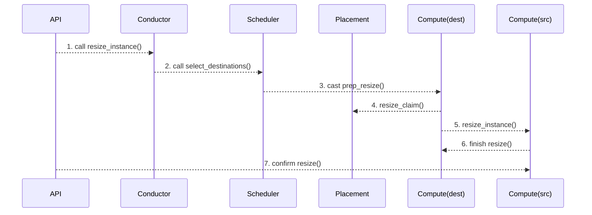
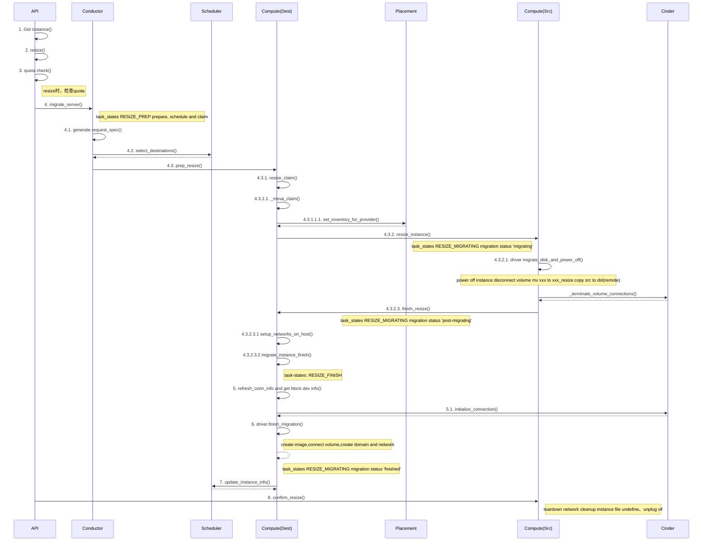
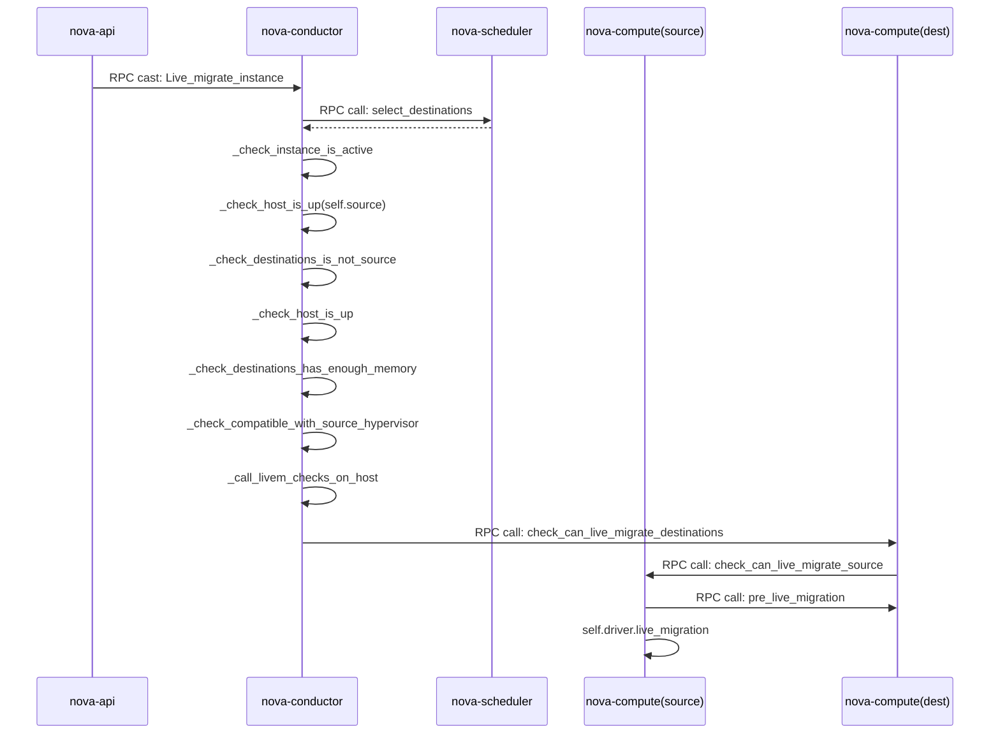

# nova 迁移流程分析

[TOC]

## 迁移实现

OpenStack迁移可以分为冷迁移、热迁移、故障迁移

### 冷迁移

#### 实现原理

使用原来所需的资源在目标节点上重新创建一个虚拟机。

在迁移时，主要流程包括调度、迁移准备、迁移、完成迁移。

1. 调度。conducotr通过select_destination访问Scheduler进行调度，最终选择一个可用的目的节点；

2. prep_resize阶段，迁移准备。在目的主机上进行一些检查，比如是否支持相同节点迁移、虚拟机的主机等检查。然后，生成了一个resize claim（不是真正的claim，目前看这个只是刷新的resource tracker的一些数据），并在Placment刷新了inventory信息。

3. resize_instance阶段，在源节点把网络、磁盘之类的断掉，并且将数据复制到目的节点；

4. 迁移结束。在目的节点配置网络、挂卷，启动虚拟机；

5. (resize-confirm)确认迁移。使用nova resize-confirm确认删除，把原来网络断掉，并完成源虚拟机数据及中间虚拟机数据的清空。

#### 具体冷迁移细节

#### 冷迁移过程总结

1. nova-api收到冷迁移请求，验证权限、配额等并获取虚拟机信息，通过消息队列向nova-conductor发起冷迁移请求

2. nova-conductor通过消息队列请求nova-scheduler选择可迁移目的宿主机

3. 获取到目的宿主机后，nova-conductor通过消息队列请求目的宿主机的nova-compute服务做资源准备工作

4. 目的宿主机进行资源准备工作，比如执行claim机制检测和预分配资源，完成后通过消息队列请求源宿主机进行虚拟机迁移准备工作

5. 源宿主机进行关机、卸载网络设备、磁盘等资源，完成后通过消息队列请求目的宿主机让它初始化好虚拟机所需的资源，比如网络虚拟设备的创建和磁盘挂载等并更新虚拟机状态为等待被确认。

6. 最后需要发起confirm_resize命令删除源主机上的该虚拟机的资源并更新虚拟机状态为正常，比如备份的虚拟机的目录

### 热迁移

#### 实现原理

热迁移与冷迁移工作流程类似，但热迁移由于是在运行中迁移，进行了比较多的兼容性判断，比如两个宿主机之间的cpu兼容性等。热迁移其实并非没有业务中断，只是在迁移的最后时刻，虚拟机会有短暂挂起，快速完成最后一次内存复制。

影响热迁移的关键因素有两个：

1. 虚拟机内存脏页的速度，迭代复制是以页为单位的；
2. 网络带宽，如果脏页的速度远大于迭代复制内存页的速度，在一段时间内迁移是不成功的。

#### 热迁移过程总结

1. nova-api收到冷迁移请求，验证权限、配额等并获取虚拟机信息，通过消息队列向nova-conductor发起热迁移请求

2. nova-conductor检查虚拟机是否是开机状态并检查源宿主机计算服务是否正常，然后通过消息队列请求nova-scheduler服务选择目的宿主机

3. 获取到目的宿主机后，对目的宿主机进行多项是否符合热迁移条件的检查，比如两宿主机的CPU是否兼容、目的宿主机是否可以做热迁移（这里会有个互相检查对方是否可以进行热迁移）等

4. nova-conductor通过消息队列服务让目的宿主机执行热迁移工作

5. 目的宿主机进行网络初始化、网络过滤规则和磁盘准备工作等并通过消息队列让源宿主机执行热迁移操作

6. 源宿主机调用libvirt的热迁移API进行热迁移操作

### 故障迁移

#### 实现原理

​	根据在数据库中保存的配置，重新生成一个一样的云主机，前提是需要能访问到故障云主机的磁盘数据，所以使用共享存储可以实现云主机故障迁移。

#### 故障迁移过程总结

1. nova-api收到故障迁移请求，验证权限、配额等并获取虚拟机信息，检查源宿主机是否真的不可用了并通过消息队列向nova-conductor发起重建虚拟机请求

2. nova-conductor通过nova-scheduler获取到目的宿主机后通过消息队列让目录宿主机执行重建操作

3. 目的宿主机做分配资源、检查是否共享存储、初始化好存储、初始化虚拟网络设备等工作后重新创建虚拟机并更新数据库元数据信息

