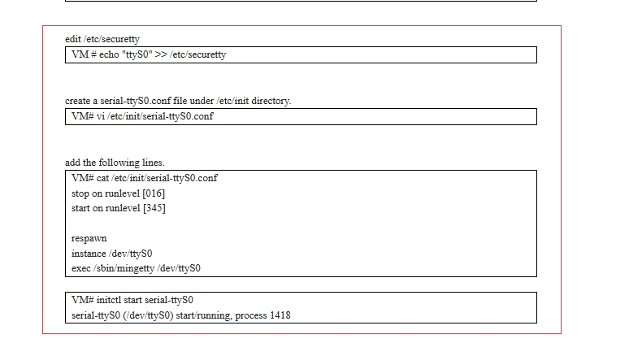
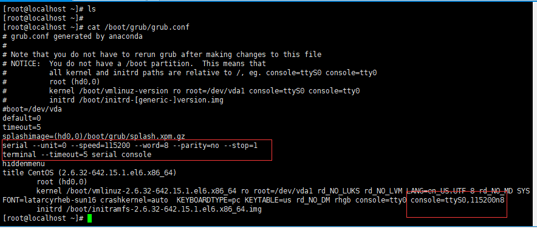

# CentOS 6 虚拟机问题


### centos6 虚拟机 通过vnc可以进入终端，通过`virsh console` 不能进入终端

解决方案：

1. 该方案不支持持久化，重启后配置失效



2. 修改 grub参数，支持持久化配置

   

参考链接

- [http://lost-and-found-narihiro.blogspot.com/2012/07/kvm-centos6-set-up-serial-console-when.html](http://lost-and-found-narihiro.blogspot.com/2012/07/kvm-centos6-set-up-serial-console-when.html)
- [kvm serial console for virtual machine (github.com)](https://gist.github.com/lukasnellen/fe9b61cb9add581ef0215bd40c09c7c2)

附件

openstack 创建的虚拟机

1. 需要通过`virsh edit <vm_uuid>`修改虚拟机xml文件，删除 标签 `<serail>和 console`等标签后 添加

   ```xml
   <serial type='pty'>
   <target port='0'/>
     </serial>
     <console type='pty'>
   <target type='serial' port='0'/>
     </console>
   ```

2. 执行 `virsh shutdown <vm_uuid>`让配置生效
3. `virsh start <vm_uuid>`打开虚拟机
4. `virsh console <vm_uuid>`进入

### 不知道虚拟机密码，如何进入虚拟机

1. 关闭虚拟机 `virsh shutdown <vm_name>`

   1. 先生成一个密码

      ```shell
      openssl passwd -1 -salt 'hello' '123456'
      $1$hello$ZwmhCpcG.I1XIfVjdarKc1
      ```

   2. 替换原有密码

       ```shell
       virt-edit -d <vm_name> /etc/shadow
       
       root:$1$bTPRDWwf$LpjUZmGTHw.hYFccl0/lK.:16804:0:99999:7:::
       更换为
       root:$1$hello$ZwmhCpcG.I1XIfVjdarKc1:16541:0:99999:7:::
       
       ```

   3. virsh xxxx start 启动虚拟机 ，使用新的root密码登录

2. 修改qcow2的密码

   1. 需要安装 `libguestfs-tools`

   2. /etc/libvirt/qemu.conf

       ```shell
       user = "root"
       # The group for QEMU processes run by the system instance. It can be
       # specified in a similar way to user.
       group = "root"
       ```

   3. 修改密码

       ```shell
       [root@localhost home]# sudo virt-customize -a /root/ubuntu.qcow2  --root-password password:root
       [   0.0] Examining the guest ...
       [ 100.3] Setting a random seed
       [ 101.4] Setting the machine ID in /etc/machine-id
       [ 101.6] Setting passwords
       [ 126.6] Finishing off
       [root@localhost home]# 
       
       ```

   

   