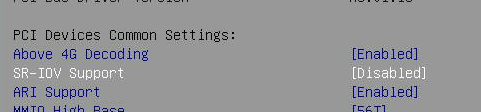

# NVIDIA A10 GPU适配

## 查看BIOS 相关配置是否已启用

- VT-D

- SRV_IO

  


##  内核加载ko文件

将 ko文件复制到 `/lib/modules/3.10.0-1160.45.1.el7.x86_64/kernel/drivers/pci`

重启主机

```shell
# NVIDIA MDEV
<hostdev mode='subsystem' type='mdev' managed='yes' model='vfio-pci' display='on'>
	<source>
		<address uuid='ecb554b7-778f-46a9-b18c-0d7e327e51ed'/>
	</source>
</hostdev>
# 直通方式
<hostdev mode='subsystem' type='pci' managed='yes'>
  <source>
    <address domain='0x0' bus='0x5e' slot='0x00' function='0x0'/>
  </source>
</hostdev>
```


