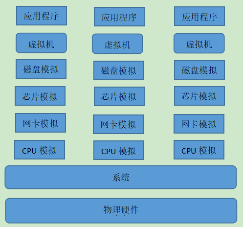
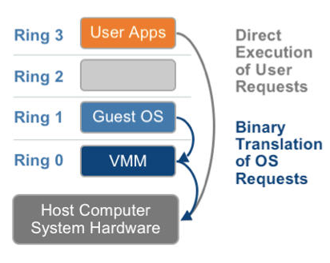
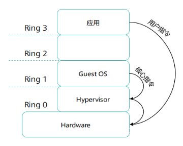
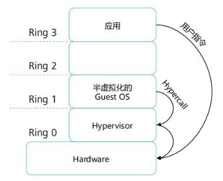
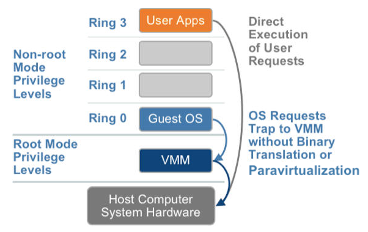

# 虚拟化基础

虚拟化在计算机方面通常是指计算元件在虚拟的基础上而不是真实的基础上运行。虚拟化技术可以扩大硬件的容量，简化软件的重新配置过程。简单说来，CPU的虚拟化技术就是单CPU模拟多CPU并行，允许一个平台同时运行多个操作系统，并且应用程序都可以在相互独立的空间内运行而互不影响，从而显著提高计算机的工作效率。

纯软件虚拟化解决方案存在很多限制。“客户”操作系统很多情况下是通过VMM(Virtual Machine Monitor，虚拟机监视器)来与硬件进行通信，由VMM来决定其对系统上所有虚拟机的访问。(注意，大多数处理器和内存访问独立于VMM，只在发生特定事件时才会涉及VMM，如页面错误。)在纯软件虚拟化解决方案中，VMM在软件套件中的位置是传统意义上操作系统所处的位茫。如处理器、内存、存储、显卡和网卡等)的接口，模拟硬件环境。这种转换必然会增加系统的复杂性。

## 1. 虚拟化类型

### 1.1 CPU虚拟化

CPU的虚拟化技术是一种硬件方案，支持虚拟技术的CPU带有特别优化过的指令集来控制虚拟过程，通过这些指令集，VMM会很容易提高性能，相比软件的虚拟实现方式会很大程度上提高性能。虚拟化技术可提供基于芯片的功能，借助兼容VMM软件能够改进纯软件解决方案。由于虚拟化硬件可提供全新的架构，支持操作系统直接在上面运行，从而无需进行二进制转换，减少了相关的性能开销，极大简化了VMM设计，进而使VMM能够按通用标准进行编写，性能更加强大。另外，在纯软件VMM中，目前缺少对64位客户操作系统的支持，而随着64位处理器的不断普及，这一严重缺点也日益突出。而CPU的虚拟化技术除支持广泛的传统操作系统之外，还支持64位客户操作系统。

两大CPU巨头英特尔和AMD都想方设法在虚拟化领域中占得先机，但是AMD的虚拟化技术在时间上要比英特尔落后几个月。英特尔自2005年末开始便在其处理器产品线中推广应用英特尔Virtualization Technology(Intel VT)虚拟化技术。目前，英特尔已经发布了具有Intel VT虚拟化技术的一系列处理器产品，包括桌面平台的Pentium 4 6X2系列、Pentium D 9X0系列和Pentium EE 9XX系列，还有Core Duo系列和Core Solo系列中的部分产品，以及服务器/工作站平台上的Xeon LV系列、Xeon 5000系列、Xeon 5100系列、Xeon MP 7000系列以及Itanium 2 9000系列；同时绝大多数的Intel下一代主流处理器，包括Merom核心移动处理器，Conroe核心桌面处理器，Woodcrest核心服务器处理器，以及基于Montecito核心的Itanium 2高端服务器处理器都将支持Intel VT虚拟化技术。

而AMD方面也已经发布了支持AMD Virtualization Technology(AMD VT)虚拟化技术的一系列处理器产品，包括Socket S1接口的Turion 64 X2系列以及Socket AM2接口的Athlon 64 X2系列和Athlon 64 FX系列等等，并且绝大多数的AMD下一代主流处理器，包括即将发布的Socket F接口的Opteron都将支持AMD VT虚拟化技术。

### 1.2 网络虚拟化

网络虚拟化是目前业界关于虚拟化细分领域界定最不明确，存在争议较多的一个概念。微软眼中的“网络虚拟化”，是指虚拟专用网络 (VPN)。VPN对网络连接的概念进行了抽象，允许远程用户访问组织的内部网络，就像物理上连接到该网络一样。网络虚拟化可以帮助保护 IT环境，防止来自 Internet 的威胁，同时使用户能够快速安全的访问应用程序和数据。

但是网络巨头思科（Cisco）不那么认为。出身、成名且目前称霸于网络的思科公司，当然在对IT未来的考虑上以网络为核心。它认为在理论上，网络虚拟化能将任何基于服务的传统客户端/服务器安置到“网络上”。那么，这意味着可以让路由器和交换机执行更多的服务，自然，思科在业界的重要性和生意额都将大幅增加。思科表示网络虚拟化由三个部分组成： 访问控制、路径提取，以及服务优势。从思科的产品规划图上看，该公司的路由器和交换机将拥有诸如安全、存储、VoIP、移动和应用等功能。 对思科而言，他们的战略是通过扩大网络基础设备的销售来持续产生盈利。 而对用户来讲，这能帮助他们提高网络设备的价值，并调整原有的网络基础设备。

对于网络阵营的另一巨头，3Com公司在网络虚拟化方面的动作比思科更大。3Com的路由器中可以插入一张工作卡。该卡上带有一套全功能的Linux服务器，可以和路由器中枢相连。在这个Linux服务器中，你可以安装诸如sniffer、VoIP、安全应用等等。此外，该公司还计划未来在Linux卡上运行VMware，以让用户运行Windows Server。3Com的这个开源网络虚拟化活动名为3Com ON(又名开放式网络)。

当然，王婆卖瓜自卖自夸，思科与3Com自己的一厢情愿决不能作为网络虚拟化大旗真正升起的标志，现在，网络虚拟化依然处于初期的萌芽阶段，但在人类网络信息化飞速需求的现在，我们有理由相信它的突破和成长将是飞速的。

### 1.3 服务器虚拟化

与网络虚拟化不同，服务器虚拟化却是虚拟化技术最早细分出来的子领域。根据2006年2月Forrester Research的调查，全球范围的企业对服务器虚拟化的认知率达到了75%。三分之一的企业已经在使用或者准备部署服务器虚拟化。这个产生于20世纪60年代的技术日益显示出其重要价值。由于服务器虚拟化发展时间长，应用广泛，所以很多时候人们几乎把服务器虚拟化等同于虚拟化。

关于服务器虚拟化的概念，各个厂商有自己不同的定义，然而其核心思想是一致的，即它是一种方法，能够通过区分资源的优先次序并随时随地能将服务器资源分配给最需要它们的工作负载来简化管理和提高效率，从而减少为单个工作负载峰值而储备的资源。

似乎与所有颠覆性技术一样，服务器虚拟化技术先是悄然出现，然后突然迸发，最终因为节省能源的合并计划而得到了认可。如今，许多公司使用虚拟技术来提高硬件资源的利用率，进行灾难恢复、提高办公自动化水平。本组文章分别从服务器、存储、应用程序和桌面虚拟化技术三个角度介绍了如何消除物理硬件的限制。

有了虚拟化技术，用户可以动态启用虚拟服务器（又叫虚拟机），每个服务器实际上可以让操作系统（以及在上面运行的任何应用程序）误以为虚拟机就是实际硬件。运行多个虚拟机还可以充分发挥物理服务器的计算潜能，迅速应对数据中心不断变化的需求。

虚拟化概念并不是新概念。早在20世纪70年代，大型计算机就一直在同时运行多个操作系统实例，每个实例也彼此独立。不过直到最近，软硬件方面的进步才使得虚拟化技术有可能出现在基于行业标准的大众化x86服务器上。

微软于2004年底宣布了其Virtual Server 2005计划。与其他服务器虚拟化技术一样，Virtual Server 2005允许用户对服务器进行分区，以使这些服务器能够支持多个操作系统和应用。计划于2005年面市的Virtual Server建立在去年年初时通过购买Connectix而获得的技术基础之上，该软件可以在Windows、Linux和Mac OS服务器及工作站上运行。

微软宣布Windows Server 2008发行版将包括虚拟化服务器(WSV)的测试版在内，Windows Server 2008是微软最新的服务器操作系统，可在一个服务器上虚拟化多种操作系统，如Windows、Linux 等等。服务器操作系统内置的虚拟化技术和更加简单灵活的授权策略，获得前所未有的易用性优势并降低成本。借助Terminal Services Gateway 和 Terminal Services RemoteApp ，可轻松进行远程访问并与本地桌面应用程序进行集成，还可实现在无需 VPN 的情况下，安全无缝地部署应用程序。

另外，在服务器虚拟化技术方面走得比较靠前的应该是IBM和HP等服务器厂商。今年以来，这两家公司在虚拟化领域也非常积极，在最新的RISC架构服务器及最新版的操作系统中，都嵌入了虚拟化技术。

先说说IBM，早在p690服务器和AIX 5L操作系统首次公布的时候，IBM就宣布在其动态逻辑分区（LPAR）技术的支持下，一个系统内可独立的运行多个分区，每个分区运行独立的操作系统。这时候的分区，是以CPU为“颗粒”的。

到去年发布p5服务器时，IBM大张旗鼓地扯出了虚拟技术的大旗。不过，与以前相比，在虚拟化技术的帮助下， IBM最新的微分区技术打破了分区上以CPU为“颗粒”的限制，可以将单个CPU划分为10个微分区，从而创建和运行比物理处理器数量更多的分区。IBM 同时宣布，新版操作系统AIX 5.3可以支持1/10 CPU颗粒的微分区。

今年，IBM进一步拓展了其服务器虚拟技术的范畴，推出了由操作系统、系统技术和系统服务三部分组成的服务器虚拟引擎。其中，操作系统涉及AIX、 i5/OS、z/OS和Linux，其技术宗旨是单台服务器内运行多种操作系统、在异构IT基础架构中以统一的方式实现资源的共享和管理以及管理非IBM 操作系统平台；系统技术包括微分区、vLan、虚拟I/O、Hypervisor等；而系统服务则包括一个服务器系统服务套件和一个存储系统服务套间。在服务器系统服务套间中，包括硬件监督模块VE console虚拟引擎控制台，可以利用两个主要的功能模块Launchpad和Health Center，监控资源的健康状态、进行问题诊断和系统管理；另外还包括硬件管理模块IBM Direction Multiplatform（DCM）整合系统管理。

同时，IBM还推出了应用虚拟工具套件，包括应用监督模块Enterprise Workload Management企业负载管理器（EWLM），可以在异构环境下自动管理分布式企业级系统，根据业务优先级将IT服务分类，并设立相应的性能目标，并根据这些性能目标，提供端到端的性能分析和评估，通过分析，EWLM自动按照应用拓扑调整网络路由。与EWLM相配合的是一个应用管理模块Tivoli Provisioning Manger（TPM），该模块与EWLM配合，可以实现系统部署和配置步骤的自动化，为IT系统的自动部署、资源分配和启用提供解决方案。

对于HP，我们最熟悉的就是HP提供三个层次的虚拟化解决方案。其中，部件虚拟化可以优化不同类型IT资源的利用，如服务器、存储和网络资源，包括分区、集群、工作负载管理和应用虚拟化；集成虚拟化可以把优化多个部件的虚拟化方法结合在一起，自动调度资源满足服务水平协议（SLO），包括虚拟服务器环境、连续访问存储专用服务器等；而完全虚拟化可以优化所有异构资源、使得资源供应能够实时满足业务需求。

HP-UX 下的分区连续技术能够把服务器划分成物理或逻辑独立的分区，为优化资源利用、提高服务器的可用性提供坚实的基础。

硬件分区 （nPars）--HP nPars 是单个服务器中的硬件分区。nPars 根据服务器类型最多提供 16 个硬件分区、完全的硬件和软件隔离能力以及在一个服务器上运行多个OS实例。

虚拟分区 （vPars）--HP vPars 具有在一个系统或硬件分区内实现执行多个OS实例的独特特性。每个 vPar 能够拥有规定的内存量、一个或多个物理内存区域、一个规定的CPU池、服务器内一个或多个I/O 卡。vPars 能够使用软件命令动态地创立和修改。因此，每个应用能够在性能最大、OS配置要求得到满足的环境中运行。

资源分区--进程资源管理软件（PRM） 能够动态地以多种方式把系统资源 （CPU， 内存和磁盘 I/O）分配给客户的应用，分配的方式可以是根据份额、百分比和处理器组 （pSets）。 pSets 允许在服务器上创立处理器组，而应用或用户可以被分配到在规定的pSet 上运行。

### 1.4 存储虚拟化

随着信息业务的不断运行和发展，存储系统网络平台已经成为一个核心平台，大量高价值数据积淀下来，围绕这些数据的应用对平台的要求也越来越高，不光是在存储容量上，还包括数据访问性能、数据传输性能、数据管理能力、存储扩展能力等等多个方面。可以说，存储网络平台的综合性能的优劣，将直接影响到整个系统的正常运行。因为这个原因，虚拟化技术又一子领域——虚拟存储技术，应运而生。

其实虚拟化技术并不是一件很新的技术，它的发展，应该说是随着计算机技术的发展而发展起来的，最早是始于70年代。由于当时的存储容量，特别是内存容量成本非常高、容量也很小，对于大型应用程序或多程序应用就受到了很大的限制。为了克服这样的限制，人们就采用了虚拟存储的技术，最典型的应用就是虚拟内存技术。

随着计算机技术以及相关信息处理技术的不断发展，人们对存储的需求越来越大。这样的需求刺激了各种新技术的出现，比如磁盘性能越来越好、容量越来越大。但是在大量的大中型信息处理系统中，单个磁盘是不能满足需要，这样的情况下存储虚拟化技术就发展起来了。在这个发展过程中也由几个阶段和几种应用。首先是磁盘条带集（RAID，可带容错）技术，将多个物理磁盘通过一定的逻辑关系集合起来，成为一个大容量的虚拟磁盘。而随着数据量不断增加和对数据可用性要求的不断提高，又一种新的存储技术应运而生，那就是存储区域网络（SAN）技术。

SAN的广域化则旨在将存储设备实现成为一种公用设施，任何人员、任何主机都可以随时随地获取各自想要的数据。目前讨论比较多的包括iSCSI、FC Over IP 等技术，由于一些相关的标准还没有最终确定，但是存储设备公用化、存储网络广域化是一个不可逆转的潮流。

所谓虚拟存储，就是把多个存储介质模块（如硬盘、RAID）通过一定的手段集中管理起来，所有的存储模块在一个存储池（Storage Pool）中得到统一管理，从主机和工作站的角度，看到就不是多个硬盘，而是一个分区或者卷，就好象是一个超大容量（如1T以上）的硬盘。这种可以将多种、多个存储设备统一管理起来，为使用者提供大容量、高数据传输性能的存储系统，就称之为虚拟存储。

### 1.5 应用虚拟化

前面几种虚拟化技术，主要还专注于对硬件平台资源的虚拟优化分配，随着IT应用的日益广泛，应用虚拟化作为虚拟化家族的明日之星登上了历史舞台。2006年7月由Forrester咨询公司在美国对各种不同行业的高层IT管理人员所做的一项研究显示，当今的机构现在将应用虚拟化当作是业务上的一个必由之路，而不是一个IT决策。据统计，全世界目前至少有超过18万个机构在利用应用虚拟化技术进行集中IT管理、加强安全性和减少总体成本。

尽管在过去十年间虚拟技术有了迅速的发展，但现实情况是，当需要使用应用系统的时候，我们仍然把自己的思维局限在电脑机箱之内。从键盘、鼠标、麦克风或扫描仪接收用户输入的设备，通常也是处理和存储数据、通过对显示器、打印机和扬声器的输出来进行响应的同一设备。然而，随着虚拟化概念的发展和变化，“应用虚拟化”成为一个正在迅速发展的市场。

何为应用虚拟化?

简单来讲，应用虚拟化技术使机构能够用更少的投入做更多的事情，并最终节省经费。这样，企业决策者就能够在IT开销与业务需求之间达成更好的平衡——由运营成本降低所节省的经费可以重新投入到能够推动增长的业务领域中。

从技术角度来讲，应用虚拟化可以简单描述为“以IT应用客户端集中部署平台为核心，以对最终用户透明的方式完全使用户的应用和数据在平台上统一计算和运行，并最终让用户获得与本地访问应用同样的应用感受和计算结果。”

虚拟化背后的主要推动力是基础设施各方面的猛烈增长，同时伴随着IT硬件和应用的大量增加。而且，IT系统正在变得越来越大，分布越来越广，并且更加复杂，因而难以管理，但要求加强IT控制的业务和监管压力却在继续增大。这听起来可能很专业，但对业务决策者来说却很中听，因为应用虚拟化正在帮助解决当今机构所面临的很多推动力方面的问题——提高业务效率、增强员工移动性、遵守安全与监管规定、向新兴市场拓展、业务外包、以及业务连续性等等。

在可能实现的一系列利益当中，应用虚拟化技术能帮助企业解决三个关键方面的问题——安全性、性能和成本。从安全角度来讲，应用虚拟化从其设计本身来看是安全的。采用客户-服务器端应用，数据安全面临风险。IT人员不仅必须应对数据的存放、打印和操控环境，而且还必须考虑数据在网络内和网络外如何迁移，并保证知识产权不会泄露，电脑病毒也不会潜入。启动应用虚拟化项目后，一个公司的所有系统和数据都被整合到了一起，从而几乎消除了在设备层面上数据被盗或数据丢失的风险。性能改善对很多公司来说是另一个吸引人的因素。因为客户-服务器端应用依靠网络来传输流量，所以它们会为网络增添带宽消耗问题。这种问题困扰着很多企业，反过来又会降低应用系统的性能。应用虚拟化技术可以将各种应用系统集中起来，只有一个通过网络传送的虚拟界面。这样可以保证在极低的带宽上实现高性能，而不管设备、网络和地点如何。所以在业务扩张或合并的情况下，企业能够在几分钟或几小时时间内让新用户上网，而不像过去那样需要几个星期或几个月。因此，容易理解为什么应用虚拟化是很多所谓的“业务流程外包”公司所欢迎的一种方式。

个人计算设备和操作系统的繁多使得客户-服务器端应用的测试、调试和客户定制开发成本高昂且耗费时间。采用应用虚拟化技术之后，将不需要在每个用户的桌面上部署和管理多个软件客户端系统，所有应用客户端系统都将一次性地部署在数据中心的一台专用服务器上，这台服务器就放在应用服务器的前面。客户也将不需要通过网络向每个用户发送实际的数据，只有虚拟的客户端界面（屏幕图像更新、按键、鼠标移动等等）被实际传送并显示在用户的电脑上。这个过程对最终用户是一目了然的，最终用户的感觉好像是实际的客户端软件正在他的桌面上运行一样。

客户-服务器端应用要求在每个用户的电脑上安装客户端软件，从而导致更高的成本，因为需要在分布式网络上管理这些软件的部署、补丁和升级。这个问题随着用户登录到每个新应用系统的需求量呈增长趋势，因为IT部门需要在每个用户的桌面上部署另一个独特的客户端设备。即便在最讲究战术的接入服务场景中，应用虚拟化可以带来的成本效益也是相当诱人的。通过将IT系统的管理集中起来，企业能够同时实现各种不同的效益——从带宽成本节约到提高IT效率和员工生产力以及延长陈旧的或当前的系统的寿命等等。

目前，应用虚拟化能够展现给用户最直接的功能还是远程应用交付，或者叫远程接入，应用虚拟化领域，从全球看，走在最前沿的厂商还是Citrix（思杰），其推出的应用虚拟化平台Citrix交付中心(Citrix Delivery Center)，即Citrix应用交付基础架构解决方案正在逐步进行中国全面本地化的进程。国内最具实力的应用虚拟化领导厂商极通科技，也在2008年7月向全球推出极通EWEBS 2008应用虚拟化系统，该产品在EWEBS 2008中采用了极通科技独创的AIP（Application Integration Protocol）技术，把应用程序的输入输出逻辑（应用程序界面）与计算逻辑指令隔离开来，在用户访问EWEBS服务器发布的应用时，在EWEBS 服务器上会为用户开设独立的会话，占用独立的内存空间，应用程序的计算逻辑指令在这个会话空间中运行，应用程序的界面会通过AIP协议传送到用户计算机上，用户计算机只需要通过网络把键盘、鼠标及其他外设的操作传送到服务器端，从服务器端接收变化的应用程序界面，并且在用户端显示出来就可以获得在本地运行应用一样的访问感受，最终实现用户客户端使用人员不受终端设备和网络带宽的限制，在任何时间、任何地点、使用任何设备、采用任何网络连接，都能够高效、安全地访问EWEBS服务器(集群)上的各种应用软件。

## 2. 虚拟化分类

### 2.1按应用分类

#### 2.1.1 操作系统虚拟化

- VMware的vSphere、workstation
- 微软的Windows Server with Hyper-v、Virtual PC
- IBM的Power VM、zVM
- Citrix的Xen

#### 2.1.2 应用程序虚拟化

- 微软的APP-V
- Citrix的Xen APP

#### 2.1.3 桌面虚拟化

- 微软的MED-V、VDI
- Citrix的Xen Desktop
- VMware的 Vmware view
- IBM的Virtual Infrastructure Access
- virt-viewer

#### 2.1.4 存储虚拟化

- VMware的vSAN
- Ceph
- Swift
- HDFS

#### 2.1.5 网络虚拟化

### 2.2 按照应用模式分类

- 一对多：其中将一个物理服务器划分为多个虚拟服务器。这是典型的服务器整合模式
- 多对一：其中整合了多个虚拟服务器，并将它们作为一个资源池。这是典型的网格计算模式
- 多对多：将前两种模式结合在一起

### 2.3 按硬件资源调用模式分类

#### 2.3.1 全虚拟化

虚拟操作系统与底层硬件完全隔离，由中间的Hypervisor层转化虚拟客户操作系统对底层硬件的调用代码，全虚拟化无需更改客户端操作系统，兼容性好。典型代表是VMare WorkStation、ESX Server早期版本、Microsoft Vitrual Server

#### 2.3.2 半虚拟化

在虚拟客户操作系统中加入特定的虚拟化指令，通过这些指令可以直接通过Hypervisor层调用硬件资源，免除有hypervisor层转换指令的性能开销。半虚拟化的典型代表Microsoft Hyper-V；Vmware的vSphere

#### 2.3.3 硬件辅助虚拟化

在CPU中加入了新的指令集和处理器运行模式，完成虚拟操作系统对硬件资源的直接调用。典型技术是Intel VT、AMD-V

### 2.4 按运行平台分类

#### 2.4.1 X86平台

由于X86体系结构服务器的蓬勃发展，基于X86体系的虚拟化技术也有了很大的进步，目前比较流行的基于X86体系的虚拟厂商有VMware Microsoft、Citrix、IBM System x系列服务器

#### 2.4.2 非X86平台

非X86平台的虚拟化鼻祖是IBM公司，早在20世纪60年代，IBM就在大型机上实现了虚拟化的商用，目前IBM的虚拟化技术包括大型机的System z系列服务器，中小企业应用的System p系列服务器；HP 的虚拟服务器环境（virtual Server Environment，VSE）以及虚拟 vPar、nPartition 和 Integrity 虚拟机（IVM）；Sun的SPARC平台的xVM等，这些都是非X86平台虚拟化的重要力量。

## 3. 虚拟化技术

虚拟化技术是一套解决方案。完整的情况需要CPU、主板芯片组、BIOS和软件的支持，例如VMM软件或者某些操作系统本身。即使只是CPU支持虚拟化技术，在配合VMM的软件情况下，也会比完全不支持虚拟化技术的系统有更好的性能。

目前虚拟化技术有**软件模拟**、**全虚拟化(使用二进制翻译)**、**半虚拟化(操作系统辅助)**、**硬件辅助虚拟化**和**容器虚拟化**

### 3.1 软件模拟

软件模拟是通过软件完全模拟**cpu**、**芯片组**、**磁盘**、**网卡**等计算机硬件；由于是软件模拟，所以理论上可以模拟任何硬件，但是非常低效，一般只用于研究测试的场景，典型的有**QEMU**

### 3.2 全虚拟化

x86平台指令集分为4个特权模式：Ring0 、Ring1、Ring2、Ring3、OS工作在Ring0级别，应用软件工作在Ring3级别，驱动程序工作在Ring1和Ring2

虚拟机越级指令进行隔离，1998年 VMware 首次找到了解决办法，通过虚拟化引擎，捕获虚拟机的指令，并进行处理，即**全虚拟化方案**。VMM工作在Ring 0 ，Guest OS工作在Ring 1 ，应用程序工作在Ring 3，可是这时候Guest OS是不知道自己工作在虚拟机里的，认为自己还是工作在Ring 0 ，所以它还是按照Ring 0级别产特权生指令，Guest OS产生的每一条指令都会被VMM截取，并翻译成宿主机平台的指令，然后交给实际的物理平台执行，由于每一条指令都需要这么翻译一下，所以这种虚拟化性能比较差。

代表作品：Vmware Workstation, KVM

### 3.3 半虚拟化

半虚拟化是对Guest OS做相应修改，以便和VMM协同运作。在硬件辅助虚拟化兴起之前，半虚拟化性能超过全虚拟化。

在半虚拟化情况下，Guest OS知道自己并不是直接运行在硬件资源上，而是运行在虚拟化环境里，工作在非Ring 0，那么它原先在物理机上执行的一些特权指令，就会修改成其他方式（超级调用），这种方式是可以和VMM约定好的，半虚拟化不需要VMM层进行二进制翻译，所以性能较好，但是实现比较麻烦（要修改OS内核代码），典型的半虚拟化技术有xen。

代表作品：Xen, VMware vSphere，Huawei FusionSphere

### 3.4 硬件辅助虚拟化

2005年，Intel推出了硬件辅助虚拟化方案，对CPU指令进行改造，即VT-x，VT-x提供了两种操作模式：VMX root operation和VMX non-root operation，VMM运行在 VMX root operation，虚拟机运行在VMX non-root operation。在绝大多数情况下，客户机在此模式下运行与原生系统在非虚拟化环境中运行性能一样，不需要像全虚拟化那样每条指令都要先翻译再执行；在少数必要的时候，某些客户机指令的运行才需要被VMM截获并做相应处理。这种方案因为是基于硬件的，所以效率非常高。

现在不仅CPU指令有硬件虚拟化方案，I/O通信也有硬件解决方案，称为VT-d；网络通信的称为VT-c。

### 3.5 容器虚拟化

容器虚拟化是基于CGroups、Namespace等技术将进程进行隔离，每个进程就像一台独立的虚拟机，拥有自己被隔离出来的资源，也有自己的根目录、独立的进程编号、被隔离的内存空间。基于容器的虚拟化可以实现在单一内核上运行多个实例。目前热门的容器虚拟化技术Docker，Docker可以将一个开发环境进行打包，很方便在另一个系统上运行起来。

## 4. 虚拟化技术的分类

### 4.1 不同抽象层次的虚拟化技术

在介绍各种虚拟化概念之前，先介绍虚拟化中的两个重要名词。在虚拟化中，物理资源通常有一个定语称为宿主（Host），而虚拟出来的资源通常有一个定语称为客户（Guest）。

在计算机系统中，从底层至高层依次可分为：硬件层、操作系统层、函数库层、应用程序层，在对某层实施虚拟化时，该层和上一层之间的接口不发生变化，而只变化该层的实现方式。从使用虚拟资源的Guest的角度来看，虚拟化可发生在上述四层中的任一层。应当注意，在对Guest的某一层进行虚拟化时，并未对Host在哪一层实现它作出要求，这一点是时常引起混淆的地方。

#### 4.1.1 硬件抽象层上的虚拟化

硬件抽象层上的虚拟化是指通过虚拟硬件抽象层来实现虚拟机，为客户机操作系统呈现和物理硬件相同或相近的硬件抽象层，又称为指令集级虚拟化，实现在此层的虚拟化粒度是最小的。

实现在此层的虚拟化技术可以对整个计算机系统进行虚拟，即可将一台物理计算机系统虚拟化为一台或多台虚拟计算机系统，故又可称作系统级虚拟化。每个虚拟计算机系统（简称为虚拟机）都拥有自己的虚拟硬件（如CPU、内存和设备等），来提供一个独立的虚拟机执行环境。每个虚拟机中的操作系统可以完全不同，并且它们的执行环境是完全独立的。由于客户机操作系统所能看到的是硬件抽象层，因此，客户机操作系统的行为和在物理平台上没有什么区别。

#### 4.1.2 操作系统层上的虚拟化

操作系统层上的虚拟化是指操作系统的内核可以提供多个互相隔离的用户态实例。这些用户态实例（经常被称为容器）对于它的用户来说就像是一台真实的计算机，有自己独立的文件系统、网络、系统设置和库函数等。

由于这是操作系统内核主动提供的虚拟化，因此操作系统层上的虚拟化通常非常高效，它的虚拟化资源和性能开销非常小，也不需要有硬件的特殊支持。但它的灵活性相对较小，每个容器中的操作系统通常必须是同一种操作系统。另外，操作系统层上的虚拟化虽然为用户态实例间提供了比较强的隔离性，但其粒度是比较粗的。

#### 4.1.3 库函数层上的虚拟化

操作系统通常会通过应用级的库函数提供给应用程序一组服务，例如文件操作服务、时间操作服务等。这些库函数可以隐藏操作系统内部的一些细节，使得应用程序编程更为简单。不同的操作系统库函数有着不同的服务接口，例如Linux的服务接口是不同于Windows的。库函数层上的虚拟化就是通过虚拟化操作系统的应用级库函数的服务接口，使得应用程序不需要修改，就可以在不同的操作系统中无缝运行，从而提高系统间的互操作性。

例如，Wine就是在Linux上模拟了Windows的库函数接口，使得一个Windows应用程序能够在Linux上正常运行。

#### 4.1.4 编程语言层上的虚拟化

另一大类编程语言层上的虚拟机称为语言级虚拟机，例如JVM（Java Virtual Machine）和微软的CLR（Common Language Runtime）。这一类虚拟机运行的是进程级的作业，所不同的是这些程序所针对的不是一个硬件上存在的体系结构，而是一个虚拟体系结构。这些程序的代码首先被编译为针对其虚拟体系结构的中间代码，再由虚拟机的运行时支持系统翻译为硬件的机器语言进行执行。

### 4.2 系统级虚拟化

系统级虚拟化即硬件抽象层上的虚拟化、指令集级虚拟化，是最早被提出和研究的一种虚拟化技术，当前存在多种此种技术的具体实现方案，在介绍它们之前，有必要先了解实现系统级虚拟化可采取的途径。

在每台虚拟机中都有属于它的虚拟硬件，通过虚拟化层的模拟，虚拟机中的操作系统认为自己仍然是独占一个系统在运行，这个虚拟化层被称为虚拟机监控器（Virtual Machine Monitor，VMM）。VMM对物理资源的虚拟可以归结为三个主要任务：处理器虚拟化、内存虚拟化和I/O虚拟化。其中，处理器虚拟化是VMM中最核心的部分，因为访问内存或进行I/O本身就是通过一些指令来实现的。

#### 4.2.1 可虚拟化架构和不可虚拟化架构

在系统级虚拟化中，虚拟计算机系统和物理计算机系统可以是两个完全不同ISA（Instruction Set Architecture，指令集架构）的系统，例如，可以在一个x86的物理计算机上运行一个安腾的虚拟计算机。但是，不同的ISA使得虚拟机的每一条指令都需要在物理机上模拟执行，从而造成性能上的极大下降。

显然，相同体系结构的系统虚拟化通常会有比较好的性能，并且VMM实现起来也会比较简单。这种情况下虚拟机的大部分指令可以在处理器上直接运行，只有那些与硬件资源关系密切的敏感指令才会由VMM进行处理。此时面前的一个问题是，要能将这些敏感指令很好地筛选出来。但事实上，某些处理器在设计之初并没有充分考虑虚拟化的需求，导致没有办法识别出所有的敏感指令，因而不具备一个完备的可虚拟化结构。

大多数的现代计算机体系结构都有两个或两个以上的特权级，用来分隔系统软件和应用软件。系统中有一些操作和管理关键系统资源的指令会被定为特权指令，这些指令只有在最高特权级上才能够正确执行。如果在非最高特权级上运行，特权指令会引发一个异常，处理器会陷入到最高特权级，交由系统软件来处理。

在x86架构中，所有的特权指令都是敏感指令，然而并不是所有的敏感指令都是特权指令。

为了VMM可以完全控制系统资源，它不允许虚拟机上操作系统直接执行敏感指令。如果一个系统上所有敏感指令都是特权指令，则能够用一个很简单的方法来实现一个虚拟环境：将VMM运行在系统的最高特权级上，而将客户机操作系统运行在非最高特权级上，当客户机操作系统因执行敏感指令而陷入到VMM时，VMM模拟执行引起异常的敏感指令，这种方法被称为“陷入再模拟”。

总而言之，判断一个架构是否可虚拟化，其核心就在于该结构对敏感指令的支持上。如果一个架构中所有敏感指令都是特权指令，则称其为可虚拟化架构，否则称为不可虚拟化架构。

##### 4.2.1.1 按照实现方法分类

1. **仿真（Emulation）**

   我们已经知道，通过陷入再模拟敏感指令的执行来实现虚拟机的方法是有前提条件的：所有的敏感指令必须都是特权指令。如果一个体系结构上存在敏感指令不属于特权指令，那么其就存在虚拟化漏洞，可以采用一些方法来填补或避免这些漏洞。最简单直接的方法是，所有指令都采用模拟来实现，就是取一条指令，就模拟出这条指令执行的效果。这种方法称作仿真。

   仿真是最复杂的虚拟化实现技术，使用仿真方法，可以在一个x86处理器上运行为PowerPC设计的操作系统，这在其它的虚拟化方案中是无法实现的。甚至可以运行多个虚拟机，每个虚拟机仿真一个不同的处理器。此外，这种方法不需要对宿主操作系统的特殊支持，虚拟机可以完全作为应用层程序运行。

   正如前面提到的，使用仿真方法的主要问题是速度会非常慢。由于每条指令都必须在底层硬件上进行仿真，因此速度减慢100倍的情况也并不稀奇。若要实现高度保真的仿真，包括周期精度、CPU的缓存行为等，实际速度差距甚至可能会达到1000倍之多。

   使用这种方式的典型实现是Bochs。

2. **完全虚拟化（Full Virtualization）**

   在客户操作系统看来，完全虚拟化的虚拟平台和现实平台是一样的，客户机操作系统察觉不到是运行在一个虚拟平台上，这样的虚拟平台可以运行现有的操作系统，无须对操作系统进行任何修改，因此这种方式被称为完全虚拟化。

   进一步说，客户机的行为是通过执行反映出来的，因此VMM需要能够正确处理所有可能的指令。在实现方式上，以x86架构为例，完全虚拟化经历了两个阶段：软件辅助的完全虚拟化和硬件辅助的完全虚拟化。

   - **软件实现的完全虚拟化**

     在x86虚拟化技术的早期，没有在硬件层次上对虚拟化提供支持，因此完全虚拟化只能通过软件实现。一个典型的做法是二进制代码翻译（Binary Translation）。

     二进制代码翻译的思想是，通过扫描并修改客户机的二进制代码，将难以虚拟化的指令转化为支持虚拟化的指令。VMM通常会对操作系统的二进制代码进行扫描，一旦发现需要处理的指令，就将其翻译成为支持虚拟化的指令块（Cache Block）。这些指令块可以与VMM合作访问受限的虚拟资源，或者显式地触发异常让VMM进一步处理。

     这种技术虽然能够实现完全虚拟化，但很难在架构上保证其完整性。因此，x86厂商在硬件上加入了对虚拟化的支持，从而在硬件架构上实现了虚拟化。

   - **硬件辅助完全虚拟化**

     可以预料，如果硬件本身加入足够的虚拟化功能，可以截获操作系统对敏感指令的执行或者对敏感资源的访问，从而通过异常的方式报告给VMM，这样就解决了虚拟化的问题。硬件虚拟化时一种完备的虚拟化方法，因而内存和外设的访问本身也是由指令来承载，对处理器指令级别的截获就意味着VMM可以模拟一个与真实主机完全一样的环境。

     Intel的VT-x和AMD的AMD-V是这一方向的代表。以VT-x为例，其在处理器上引入了一个新的执行模式用于运行虚拟机，当虚拟机执行在这个特殊模式中时，它仍然面对的是一套完整的处理器寄存器集合和执行环境，只是任何敏感操作都会被处理器截获并报告给VMM。

     在当前的系统级虚拟化解决方案中，全虚拟化应用得非常普遍，典型的有知名的产品有VirtualBox、KVM、VMware Workstation和VMware ESX（它在其4.0版，被改名为VMware vSphere）、Xen（也支持全虚拟化）。

3. **类虚拟化（Para-Virtualization）**

   这样的虚拟平台需要对所运行的客户机操作系统进行或多或少的修改使之适应虚拟环境，因此客户机操作系统知道其运行在虚拟平台上，并且会去主动适应。这种方式被称为类虚拟化，有时也称作半虚拟化。另外，值得指出的是，一个VMM可以既提供完全虚拟化的虚拟平台，又提供类虚拟化的虚拟平台。

   类虚拟化是通过在源代码级别修改指令以回避虚拟化漏洞的方式来使VMM 能够对物理资源实现虚拟化。上面谈到x86 存在一些难以虚拟化的指令，完全虚拟化通过Binary Translation在二进制代码级别上来避免虚拟化漏洞。类虚拟化采取的是另一种思路，即修改操作系统内核的代码，使得操作系统内核完全避免这些难以虚拟化的指令。

   既然内核代码已经需要修改，类虚拟化进一步可以被用于优化I/O。也就是说，类虚拟化不是去模拟真实世界中的设备，因为太多的寄存器模拟会降低性能．相反，类虚拟化可以自定义出高度优化的协议I/O。这种I/O协议完全基于事务，可以达到近似物理机的速度。

   这种虚拟技术以Xen为代表，微软的Hyper-V所采用技术和Xen类似，也可以把Hyper-V归属于半虚拟化。

##### 4.2.1.2 按照实现结构分类

在系统级虚拟化的实现中，VMM是一个关键角色，前面已介绍过VMM的组成部分。从Host实现VMM的角度出发，还可以将当前主流的虚拟化技术按照实现结构分为如下三类。

  1. **Hypervisor模型**

     Hypervisor这个术语是在 20 世纪 70 年代出现的，在早期计算机界，操作系统被称为Supervisor，因而能够在其他操作系统上运行的操作系统被称为 Hypervisor。

     在Hypervisor模型中，VMM首先可以被看做是一个完备的操作系统，不过和传统操作系统不同的是，VMM是为虚拟化而设计的，因此还具备虚拟化功能。从架构上来看，首先，所有的物理资源如处理器、内存和I/O设备等都归VMM所有，因此，VMM承担着管理物理资源的责任；其次，VMM需要向上提供虚拟机用于运行客户机操作系统，因此，VMM还负责虚拟环境的创建和管理。

     由于VMM同时具备物理资源的管理功能和虚拟化功能，因此，物理资源虚拟化的效率会更高一些。在安全方面，虚拟机的安全只依赖于VMM的安全。Hypervisor模型在拥有虚拟化高效率的同时也有其缺点。由于VMM完全拥有物理资源，因此，VMM需要进行物理资源的管理，包括设备的驱动。我们知道，设备驱动开发的工作量是很大的。因此，对于Hypervisor模型来说这是个很大的挑战。事实上，在实际的产品中，基于Hypervisor模型的VMM通常会根据产品定位，有选择地挑选一些I/O设备来支持，而不是支持所有的I/O设备。

     采用这种模型的典型是面向企业级应用的VMware vSphere。

  2. **宿主模型**

     混合模型是上述两种模式的汇合体。VMM依然位于最低层，拥有所有的物理资源。与Hypervisor模式不同的是，VMM 会主动让出大部分I/O设备的控制权，将它们交由一个运行在特权虚拟机中的特权操作系统控制。相应地，VMM 虚拟化的职责也被分担．处理器和内存的虚拟化依然由VMM来完成，而I/O的虚拟化则由VMM和特权操作系统共同合作来完成。

     I/O设备虚拟化由VMM和特权操作系统共同完成，因此，设备模型模块位于特权操作系统中，并且通过相应的通信机制与VMM合作。

     混合模型集中了上述两种模型的优点。 VMM可以利用现有操作系统的I/O设备驱动程序，不需要另外开发。VMM直接控制处理器、内存等物理资源，虚拟化的效率也比较高。

     在安全方面，如果对特权操作系统的权限控制得当，虚拟机的安全性只依赖于VMM。当然，混合模型也存在缺点。由于特权操作系统运行在虚拟机上，当需要特权操作系统提供服务时，VMM需要切换到特权操作系统，这里面就产生上下文切换的开销。当切换比较频繁时，上下文切换的开销会造成性能的明显下降。出于性能方面的考虑，很多功能还是必须在VMM 中实现，如调度程序和电源管理等。

     采用这种模型的典型是Xen。

  3. **混合模型**

     混合模型是上述两种模式的汇合体。VMM依然位于最低层，拥有所有的物理资源。与Hypervisor模式不同的是，VMM 会主动让出大部分I/O设备的控制权，将它们交由一个运行在特权虚拟机中的特权操作系统控制。相应地，VMM 虚拟化的职责也被分担．处理器和内存的虚拟化依然由VMM来完成，而I/O的虚拟化则由VMM和特权操作系统共同合作来完成。

     I/O设备虚拟化由VMM和特权操作系统共同完成，因此，设备模型模块位于特权操作系统中，并且通过相应的通信机制与VMM合作。

     混合模型集中了上述两种模型的优点。 VMM可以利用现有操作系统的I/O设备驱动程序，不需要另外开发。VMM直接控制处理器、内存等物理资源，虚拟化的效率也比较高。

     在安全方面，如果对特权操作系统的权限控制得当，虚拟机的安全性只依赖于VMM。当然，混合模型也存在缺点。由于特权操作系统运行在虚拟机上，当需要特权操作系统提供服务时，VMM需要切换到特权操作系统，这里面就产生上下文切换的开销。当切换比较频繁时，上下文切换的开销会造成性能的明显下降。出于性能方面的考虑，很多功能还是必须在VMM 中实现，如调度程序和电源管理等。

     采用这种模型的典型是Xen。

### 4.3 操作系统级虚拟化

在操作系统虚拟化技术中，每个节点上只有唯一的系统内核，不虚拟任何硬件设备。通过使用操作系统提供的功能，多个虚拟环境之间可以相互隔离。通常所说的容器（Container）技术，如目前为止最流行的容器系统Docker，即属于操作系统级虚拟化。此外，在不同的场景中，隔离出的虚拟环境也被称作虚拟环境（即VE，Virtual Environment）或虚拟专用服务器（即VPS，Virtual Private Server）。

以容器技术为例，它有自己独特的优点，它的出现，一方面解决了传统操作系统所忽视和缺乏的应用程序间的独立性问题，另一方面，它避免了相对笨重的系统级虚拟化，是一种轻量级的虚拟化解决方案。

操作系统领域一直以来面临的一个主要挑战来自于应用程序间存在的相互独立性和资源互操作性之间的矛盾，即每个应用程序都希望能运行在一个相对独立的系统环境下，不受到其他程序的干扰，同时又能以方便快捷的方式与其他程序交换和共享系统资源。当前通用操作系统更强调程序间的互操作性，而缺乏对程序间相对独立性的有效支持，然而对于许多分布式系统如Web服务、数据库、游戏平台等应用领域，提供高效的资源互操作同保持程序间的相对独立性具有同等重要的意义。

主流虚拟化产品VMware和Xen等均采用Hypervisor模型（Xen采用的混合模型与Hypervisor模型差别不大，可统称为Hypervisor模型）。该模型通过将应用程序运行在多个不同虚拟机内，实现对上层应用程序的隔离。但由于Hypervisor 模型倾向于每个虚拟机都拥有一份相对独立的系统资源，以提供更为完全的独立性，这种策略造成处于不同虚拟机内的应用程序间实现互操作非常困难。例如， 即使是运行在同一台物理机器上，如果处于不同虚拟机内，那么应用程序间仍然只能通过网络进行数据交换，而非共享内存或者文件。而如果使用容器技术，由于各容器共享同一个宿主操作系统，能够在满足基本的独立性需求的同时提供高效的系统资源共享支持。

容器技术还可以更高效地使用系统资源，由于容器不需要进行硬件虚拟以及运行完整操作系统等额外开销，相比虚拟机技术，一个相同配置的主机，往往可以运行更多数量的应用。此外，容器还具有更快速的启动时间，传统的虚拟机技术启动应用服务往往需要数分钟，而对于容器由于，直接运行于宿主内核，无需启动完整的操作系统，因此可以做到秒级、甚至毫秒级的启动时间，大大的节约了应用开发、测试、部署的时间。

## 5. 典型虚拟化技术实现及其特点

### 5.1 系统级虚拟化实现

#### 5.1.1 VMware

VMware是x86 虚拟化软件的主流广商之一。VMware的5位创始人中的3位曾在斯坦福大学研究操作系统虚拟化，项目包括SimOS系统模拟器和Disco虚拟机监控器。1998年，他们与另外两位创始人共同创建了VMware 公司，总部位于美国加州Palo Alto。

VMware提供一系列的虚拟化产品，产品的应用领域从服务器到桌面。下面是VMware主要产品的简介，包括VMware ESX、VMware Server和VMware Workstation。

VMware ESX Server是VMware的旗舰产品，后续版本改称VMware vSphere。ESX Server基于Hypervisor模型，在性能和安全性方面都得到了优化，是一款面向企业级应用的产品。VMware ESX Server支持完全虚拟化，可以运行Windows 、Linux、Solaris和Novell Netware等客户机操作系统。VMware ESX Server也支持类虚拟化，可以运行Linux 2. 6. 21 以上的客户机操作系统。ESX Server的早期版本采用软件虚拟化的方式，基于Binary Translation技术。自ESX Server 3开始采用硬件虚拟化的技术，支持Intel VT技术和AMD-V技术。

VMware Server之前叫VMware GSX Server，是VMware面向服务器端的入门级产品。VMware Server采用了宿主模型，宿主机操作系统可以是Windows或者Linux。VMware Server的功能与ESX Server类似，但是在性能和安全性上与ESX Server有所差距。VMware Server也有自己的优点，由于采用了宿主模型，因此VMware Server支持的硬件种类要比ESX Server多。

VMware Workstation是VMware面向桌面的主打产品。与VMware Server类似，VMware Workstation也是基于宿主模型，宿主机操作系统可以是Windows或者Linux。VMware Workstation也支持完全虚拟化，可以运行Windows、Linux、Solaris、Novell Netware和FreeBSD等客户机操作系统。与VMware Server不同， VMware Workstation专门针对桌面应用做了优化，如为虚拟机分配USB设备，为虚拟机显卡进行3D加速等。

#### 5.1.2 Microsoft

微软在虚拟化产品方面起步比VMware晚，但是在认识到虚拟化的重要性之后，微软通过外部收购和内部开发，推出了一系列虚拟化产品，目前已经形成了比较完整的虚拟化产品线。微软的虚拟化产品涵盖了服务器虚拟化（Hyper-V）和桌面虚拟化（Virtual PC）。

Virtual PC是而向桌面的虚拟化产品，最早由Connectix公司开发，后来该产品被微软公司收购。Virtual PC是基于宿主模型的虚拟机产品，宿主机操作系统是Windows。早期版本也采用软件虚拟化方式，基于Binary Translation技术。之后版本已经支持硬件虚拟化技术。

Windows Server 2008是微软推出的服务器操作系统，其中一项重要的新功能是虚拟化功能。其虚拟化架构采用的是混合模型，重要组件之一Hyper-V作为Hypervisor运行在最底层，Server 2008本身作为特权操作系统运行在Hyper-V之上。Server 2008采用硬件虚拟化技术，必须运行在支持Intel VT技术或者AMD-V 技术的处理器上。

#### 5.1.3 Xen

Xen是一款基于GPL授权方式的开源虚拟机软件。Xen起源于英国剑桥大学Ian Pratt领导的一个研究项目，之后，Xen独立出来成为一个社区驱动的开源软件项目。Xen社区吸引了许多公司和科研院所的开发者加入，发展非常迅速。之后，Ian成立了XenSource公司进行Xen的商业化应用，并且推出了基于Xen的产品Xen Server。2007年，Ctrix公司收购了XenSource公司，继续推广Xen的商业化应用，Xen开源项目本身则被独立到[http://www.xen.org。](http://www.xen.org./)

从技术角度来说，Xen基于混合模型，特权操作系统（ 在Xen中称作Domain 0）可以是Linux、Solaris以及NetBSD，理论上，其他操作系统也可以移植作为Xen的特权操作系统。Xen最初的虚拟化思路是类虚拟化，通过修改Linux内核，实现处理器和内存的虚拟化，通过引入I/O的前端驱动/后端驱动（front / backend）架构实现设备的类虚拟化。之后也支持了完全虚拟化和硬件虚拟化技术。

#### 5.1.4 KVM

KVM（Kernel-based Virtual Machine）也是一款基于GPL授权方式的开源虚拟机软件。KVM 最早由Qumranet公司开发，在2006年出现在Linux内核的邮件列表上，并于2007年被集成到了Linux 2.6.20内核中，成为内核的一部分。

KVM支持硬件虚拟化方法，并结合QEMU来提供设备虚拟化。KVM的特点在于和Linux内核结合得非常好，而且和Xen一样，作为开源软件，KVM的移植性也很好。

#### 5.1.5 Oracle VM VirtualBox

VirtualBox是一款开源虚拟机软件，类似于VMware Workstation。VirtualBox 是由德国Innotek公司开发，由Sun Microsystems公司出品的软件，使用Qt编写，在 Sun 被 Oracle 收购后正式更名成 Oracle VM VirtualBox。Innotek 以 GNU General Public License (GPL) 释出 VirtualBox。用户可以在VirtualBox上安装并且执行Solaris、Windows、DOS、Linux、BSD等系统作为客户端操作系统。现在由甲骨文公司进行开发，是甲骨文公司VM虚拟化平台技术的一部分。

#### 5.1.6 Bochs

Bochs 是一个 x86 计算机仿真器，它在很多平台上（包括 x86、PowerPC、Alpha、SPARC 和 MIPS）都可以移植和运行。使 Bochs 不仅可以对处理器进行仿真，还可以对整个计算机进行仿真，包括计算机的外围设备，比如键盘、鼠标、视频图像硬件、网卡（NIC）等。

Bochs 可以配置作为一个老式的 Intel® 386 或其后继处理器使用，例如 486、Pentium、Pentium Pro 或 64 位处理器。它甚至还可以对一些可选的图形指令进行仿真，例如 MMX 和 3DNow。

#### 5.1.7 QEMU

QEMU是一套由Fabrice Bellard所编写的模拟处理器的自由软件。它与Bochs，PearPC近似，但其具有某些后两者所不具备的特性，如高速度及跨平台的特性，qemu可以虚拟出不同架构的虚拟机，如在x86平台上可以虚拟出power机器。kqemu为qemu的加速器，经由kqemu这个开源的加速器，QEMU能模拟至接近真实电脑的速度。

QEMU本身可以不依赖于KVM，但是如果有 KVM的存在并且硬件(处理器)支持比如Intel VT功能，那么QEMU在对处理器虚拟化这一块可以利用KVM提供的功能来提升性能。换言之，KVM缺乏设备虚拟化以及相应的用户空间管理虚拟机的工具，所以它借用了QEMU的代码并加以精简，连同KVM一起构成了一个完整的虚拟化解决方案，不妨称之为：KVM+QEMU。

### 5.2 操作系统级虚拟化实现

#### 5.2.1 chroot

容器的概念始于 1979 年的 UNIX chroot，它是一个 UNIX 操作系统上的系统调用，用于将一个进程及其子进程的根目录改变到文件系统中的一个新位置，让这些进程只能访问到该目录。这个功能的想法是为每个进程提供独立的磁盘空间。其后在 1982年，它被加入到了 BSD 系统中。

#### 5.2.2 LXC

LXC 的意思是 LinuX Containers，它是第一个最完善的 Linux 容器管理器的实现方案，是通过 cgroups 和 Linux 名字空间namespace实现的。LXC 存在于 liblxc 库中，提供了各种编程语言的 API 实现，包括 Python3、Python2、Lua、Go、Ruby 和 Haskell 等。与其它容器技术不同的是， LXC 可以工作在普通的 Linux 内核上，而不需要增加补丁。现在 LXC project 是由 Canonical 公司赞助并托管的。

#### 5.2.3 Docker

Docker 是到现在为止最流行和使用广泛的容器管理系统。它最初是一个叫做 dotCloud 的 PaaS 服务公司的内部项目，后来该公司改名为 Docker。Docker 开始阶段使用的也是 LXC ，之后采用自己开发的 libcontainer 替代了它。不像其它的容器平台，Docker 引入了一整个管理容器的生态系统，这包括高效、分层的容器镜像模型、全局和本地的容器注册库、清晰的 REST API、命令行等等。稍后的阶段， Docker 推动实现了一个叫做 Docker Swarm 的容器集群管理方案。

#### 5.2.4 Linux VServer

Linux-VServer 也是一个操作系统级虚拟化解决方案。Linux-VServer 对 Linux 内核进行虚拟化，这样多个用户空间环境—又称为 Virtual Private Server（VPS） 就可以单独运行，而不需要互相了解。Linux-VServer 通过修改 Linux 内核实现用户空间的隔离。

Linux-VServer 也使用了 chroot 来为每个 VPS 隔离 root 目录。虽然 chroot 允许指定新 root 目录，但还是需要其他一些功能（称为 Chroot-Barrier）来限制 VPS 脱离其隔离的 root 目录回到上级目录。给定一个隔离的 root 目录之后，每个 VPS 就可以拥有自己的用户列表和 root 密码。

2.4 和 2.6 版本的 Linux 内核支持 Linux-VServer，它可以运行于很多平台之上，包括 x86、x86-64、SPARC、MIPS、ARM 和 PowerPC。

#### 5.2.5 Virtuozzo/OpenVZ

Virtuozzo是SWsoft公司（目前SWsoft已经改名为Parallels）的操作系统虚拟化软件的命名，Virtuozzo是商业解决方案，而OpenVZ是以Virtuozzo为基础的开源项目，它们采用的也是操作系统级虚拟化技术。OpenVZ 类似于 Linux-VServer，它通过对 Linux 内核进行补丁来提供虚拟化、隔离、资源管理和状态检查。每个 OpenVZ 容器都有一套隔离的文件系统、用户及用户组等。
