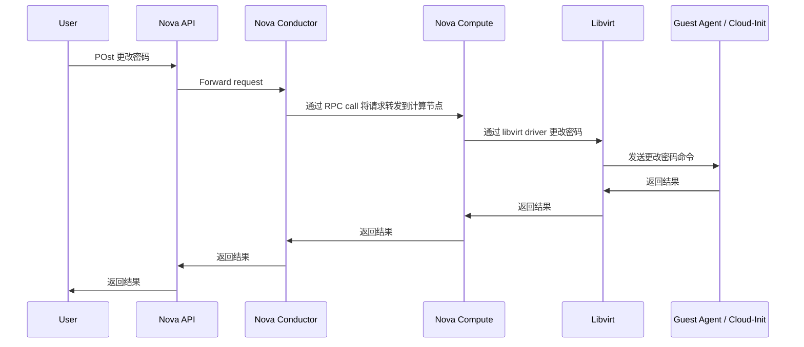

# 更改密码功能解析

## 功能实现

社区版的更改密码是基于 qemu-guest-agent实现的，要求虚拟机状态是在线的 ，而且虚拟机内部需要安装有 qemu-guest-agent，且qemu-ga进程已启动。才能保证密码更改成功

## 流程分析

```mermaid
sequenceDiagram
participant User
		participant NovaAPI as Nova API
    participant Conductor as Nova Conductor
    participant Compute as Nova Compute
    participant Libvirt as Libvirt
    participant GuestAgent as Guest Agent / Cloud-Init
User ->> NovaAPI: POst 更改密码
NovaAPI ->> Conductor: Forward request
Conductor ->> Compute: 通过 RPC call 将请求转发到计算节点
Compute ->> Libvirt: 通过 libvirt driver 更改密码
Libvirt ->> GuestAgent: 发送更改密码命令
GuestAgent ->> Libvirt: 返回结果
Libvirt ->> Compute: 返回结果
Compute ->> Conductor:返回结果
Conductor ->> NovaAPI: 返回结果
NovaAPI ->> User: 返回结果
```

