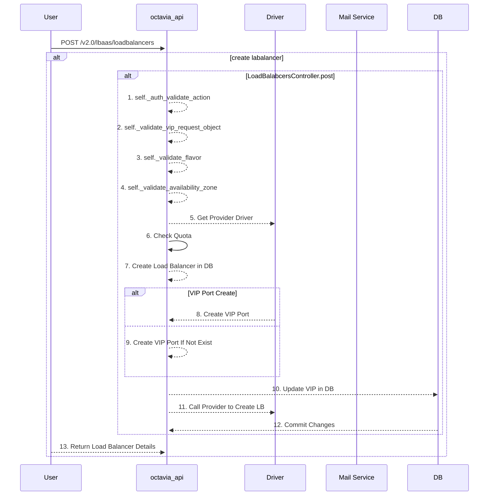

# octavia调研

## 简介

Octavia 是一个面向运营商级别的开源可扩展负载均衡器，适用于大型 OpenStack 部署。

Octavia 为 OpenStack 提供负载均衡 API。它支持多种实现负载均衡的“提供者驱动程序”，其中包括 Octavia 自带的“amphora”参考驱动程序。

Octavia 之前由 Neutron LBaaS 项目承担，影响了Neutron LBaaS项目的转型，Neutron LBaaS 从版本1转为版本2。从OpenStack的Liberty发行版开始，Octavia 成为Neutron LBaaS第2版的参考实现。从 Pike 版本开始，Octavia 就可以作为独立的Keystone服务而不再是 Neutron 的一个 service plugin，同时，CLI 命令也作为 openstack 命令行的一部分，而不是通过 neutron 调用。

## 架构图

- 软件架构图

  

Octavia 的软件架构设计依旧是常见的「生产者-消费者」模型，API与Worker分离并通过MessageQueens进行通信。Octaiva 4.0版本由以下组件组成

- amphorae

  Amphorae 是提供负载均衡服务的具体实体，可以是虚拟机、容器或裸机服务器。这些实体为租户的应用环境实现负载均衡服务。在 Octavia 0.8 版本中，Amphorae 的参考实现是运行 HAProxy 的 Ubuntu 虚拟机。

- controller

  - API Controlelr：运行 Octavia 的 API。它接收 API 请求，对其进行简单的校验，然后通过 Oslo 消息总线将请求传递给控制器工作器。
  - Controller Worker：从 API 控制器接收经过校验的 API 命令，并执行完成 API 请求所需的操作。
  - Health Manager：监控各个 Amphorae 实例，确保它们正常运行且状态健康。如果某些 Amphorae 意外故障，它还负责处理故障转移事件。
  - Housekeeping Manager：清理过时（已删除）的数据库记录，并管理 Amphorae 的证书轮换。
  - Driver Agent：接收来自提供程序驱动的状态和统计信息更新。

- network

  Octavia 的功能依赖于网络环境的操作。Amphorae 会在“负载均衡网络”中创建网络接口，此外，它们也可以直接连接到租户网络，从而与后端池成员通信。具体的网络部署方式取决于租户的负载均衡服务配置。

## 基本概念


### 1. LBaas

对于 OpenStack 平台而言，LB（负载均衡）被作为一种服务提供给用户，用户得以按需地、随时地获取可配置的业务负载均衡方案，这就是所谓 Load Balancing as a Service

### 2. loadbalancer

octavia 的实现就是由 amphora 镜像起来的虚拟机实例，即创建 loadbalancer 就是创建 amphora 虚机。

### 3. listener

监听器即一个不断在端口上检查连接请求的进程，一旦发现客户端的连接请求，则会按照你设定的规则将连接请求转发给后端的服务器池。一个监听器关联一个端口，如：HTTP(80)、HTTPS（443），当使用HTTPS，则需要上传用于https 加密和解密的证书到监听器中。

### 4. Pool

服务器池即后端一组提供服务的实例，每个成员都是一个IP地址+4层的端口。octavia 实现为 haproxy 配置中的一个 backend。

### 5. member

业务云主机，下属于 Pool，对应传统负载均衡体系中的 Real Server。

### 6. health-monitor

健康检测的机制是指是负载均衡器通过定期的心跳信号检测服务器池中的服务器运行状态，从而排除掉后端故障的主机，保证服务整体正常。

支持的健康检测方式包括 ICMP、TCP、HTTP几种。

- ICMP是最简单的，通过ping 和echo的方式，看根据服务器是否响应。只要服务器操作系统TCP/IP协议栈运行正常，网卡不出问题，服务器到负载均衡之间的网络正常，ICMP的方式都起到良好的作用，但以上情况都不能代表服务器上面运行的应用是正常的。
- TCP是4层的检测方式，相比ICMP、TCP会请求主机的特定端口，看特定的端口能否正常响应。
- HTTP的方式则更进一筹，会通过get特定的页面，根据HTTP的返回代码来判断应用是否正常。

健康监测的指标越精确，越能反映服务的实际响应情况，如果是web服务，最好是使用HTTP的方式，这样检测结果更可信。

### 7. health-manager

检查虚拟机状态，和虚拟机中的octavia agent通信，来更新各个组件的状态。

⚠️   health-monitor 监控对象的不同

### 8. amphora-agent

位于虚拟机内部，对下是接受指令操作下层的 haproxy 软件，对上是和 health-manager 通信汇报各种情况

## 基本使用流程


**Amphora**：实体云主机，作为负载均衡器的载体，也是Octavia的Default Loadbalancer Provider

**lb-mgmt-net**: 一个与 OpenStack Management/API Network 打通的网络，project admin 可见，东侧连接 Amphora Instance、西侧连接 Octavia 服务进程。

**tennat-net**: 业务云主机所在的网络

**vip-net:**提供 VIP 地址池的网络

> [!NOTE]
>
> vip-net 和 tenant-net 可以是同一个网络，但在生产环境中，我们建议分开，以更有针对性的施加安全策略，划分不同级别的网络安全隔离域

## 代码结构

### 项目主目录


- amphorae
  - 包含实现 Amphorae（负载均衡实例）相关功能的代码。
  - 管理 Amphorae 的生命周期，包括创建、监控、删除等操作

- api

  - 提供 Octavia 的 API 接口
  - 处理来自用户的请求，将其传递给后端控制器

- certificates

  - 管理 Amphorae 使用的证书和密钥
  - 涉及证书生成、分发和轮换等功能

- cmd

  - 包含启动或管理 Octavia 的命令行工具
  - 通常定义守护进程或其他服务的入口点

- common

  - 公共工具和代码库
  - 包含项目中共享的常用函数、配置管理、日志记录等

- compute

  - 管理 Amphorae 的计算资源
  - 与底层虚拟化或容器平台交互，创建或销毁计算实例

- controller

  - 实现控制器核心功能
  - 包含 API 控制器、工作器、健康管理器等组件的代码

- db

  - 数据库管理相关代码
  - 包括数据库模型定义、迁移脚本和查询操作

- distributor

  - 分发请求的组件，可能涉及负载均衡算法或策略实现

- image

  - 处理 Amphorae 镜像的管理和操作
  - 包括镜像生成、分发和更新

- network

  - 负责网络相关操作
  - 包括创建、配置和管理与 Amphorae 和后端池的网络连接

- policies

  - 访问控制和安全策略管理
  - 包含用户权限检查和策略定义

- statistics

  - 收集和管理负载均衡器的运行状态与统计数据
  - 提供监控和分析功能

- volume

  - 处理与存储（volume）相关的功能
  - 包括与后端存储服务交互或卷管理操作

  

### controller目录


- **healthmanager**

  - 健康管理子模块，负责监控和维护 Amphorae 的状态。
  - health_manager.py：健康管理器的主要实现，负责检测 Amphorae 的健康状况，以及在 Amphorae 出现故障时执行故障切换操作

- **housekeeping**

  - 管理和清理任务的字模块
  - house_keeping.py：实现 housekeeping 管理器，清理过期的数据库记录、轮换 Amphorae 的证书等

- **queue**

  - 消息队列处理模块，负责处理通过 Oslo 消息队列传递的 API 请求。
  - v2：支持 API v2 的子模块
    - consumer.py：负责从消息队列中消费消息
    - endpoints.py：定义队列中支持的端点和操作

- **worker**

  - 工作器模块，负责执行具体的 API 请求

  - amphora_rate_limit.py：实现与 Amphorae 相关的速率限制功能

  - task_utils.py：提供任务相关的工具和实用函数

  - v2：支持 API v2 的子模块。

    - controller_worker.py：控制器工作器的主要实现，负责从队列中接收任务并执行相应操作

    - flows：包含工作器的工作流逻辑（如负载均衡器的创建或更新）

    - taskflow_jobboard_driver.py：TaskFlow 的任务驱动实现

    - tasks：任务子模块，包含具体的任务实现

### loadbalancer 创建流程分析

- CLI

  ```bash
   openstack loadbalancer create --vip-subnet-id lb-vip-subnet --name lb1
  ```

- API

  - url

    ```bash
    POST /v2.0/lbaas/loadbalancers
    ```

  - req body

    ```bash
    {
      "loadbalancer": {
        "vip_subnet_id": "c55e7725-894c-400e-bd00-57a04ae1e676",
        "name": "lb1",
        "admin_state_up": true
      }
    }
    
    ```

  - resp

    ```bash
    {
      "loadbalancer": {
        "provider": "octavia",
        "flavor_id": "",
        "description": "",
        "provisioning_status": "PENDING_CREATE",
        "created_at": "2018-10-22T02:52:04",
        "admin_state_up": true,
        "updated_at": null,
        "vip_subnet_id": "c55e7725-894c-400e-bd00-57a04ae1e676",
        "listeners": [],
        "vip_port_id": "6629fef4-fe14-4b41-9b73-8230105b2e36",
        "vip_network_id": "1078e169-61cb-49bc-a513-915305995be1",
        "vip_address": "10.0.1.7",
        "pools": [],
        "project_id": "2e560efadb704e639ee4bb3953d94afa",
        "id": "5bcf8e3d-9e58-4545-bf80-4c0b905a49ad",
        "operating_status": "OFFLINE",
        "name": "lb1"
      }
    }
    
    ```

    





## 参考链接

1. [openstack/octavia: Load Balancing as a Service (LBaaS) for OpenStack. Mirror of code maintained at opendev.org.](https://github.com/openstack/octavia)

2. [Introducing Octavia — octavia 15.1.0.dev33 documentation](https://docs.openstack.org/octavia/latest/reference/introduction.html)

3. [Octavia 的实现与分析（OpenStack Rocky） - 云物互联 - 博客园](https://www.cnblogs.com/jmilkfan-fanguiju/p/10589749.html)

   