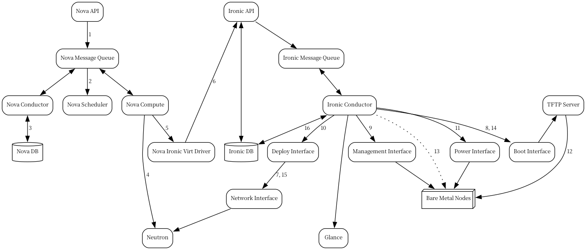

# ironic

## 简介

ironic是一个OpenStack项目，为裸机机器提供服务，它可以单独使用，也可以作为OpenStack Cloud的一部分使用，并和keystone、nova、neutron、glance、swift服务集成。支持 PXE和IPMI以特定的远程管理协议。

### 概念架构

### ironic 服务组件

- **ironic-api**

  restful api，它通过将应用程序请求发送到 ironic-conductor 

- **ironic-conductro**

  添加/编辑/删除节点；通过 IPMI 或其他特定于厂商的协议对节点进行开关机操作；对裸金属节点进行配置/部署/清理；ironic-conductor 使用驱动程序来执行对硬件的操作。

- **ironic-python-agent**

  一种运行在临时内存盘中的 Python 服务，为 ironic-conductor 和 ironic-inspector 提供远程访问、带内硬件控制以及硬件检测功能。

#### 其他组件

- **python-ironicclient**

  一个命令行界面（CLI）和 Python 绑定，用于与裸金属服务进行交互。

- **ironic-ui**

  Horizon 仪表板，提供裸金属 API 的图形界面（GUI）。

- **ironic-inspector**

  一个关联服务，通过 PXE 启动未注册的硬件进入 ironic-python-agent ramdisk，从而执行带内硬件检测。

- **diskimage-builder**

  一个相关项目，用于简化创建 ramdisk 和机器镜像的过程，例如运行 ironic-python-agent 的镜像。

- **bifrost**

  一组 Ansible playbook，自动化任务，使用 ironic 在独立模式下将基础镜像部署到一组已知硬件上。

## 基本要求

在部署过程开始之前，必须满足以下先决条件：

1. **裸金属服务节点上的依赖包**

   在运行 ironic-conductor 的裸金属服务节点上，需要配置一些依赖包，如 tftp-server、ipmi、grub/ipxe 等，以支持裸金属配置。

2. **Nova 配置**

   Nova 必须配置为使用裸金属服务的端点，并且在 Nova 计算节点上应配置计算驱动程序使用 Ironic 驱动程序。

3. **Flavors 配置**

   为可用的硬件创建相应的 Flavor。Nova 必须知道用于启动的 Flavor。

4. **镜像**

   镜像需要在 Glance 中提供。以下是成功裸金属部署所需的一些镜像类型：

   - bm-deploy-kernel
   - bm-deploy-ramdisk
   - user-image
   - user-image-vmlinuz
   - user-image-initrd

5. **硬件注册**

   必须通过裸金属 API 服务注册硬件。

## 部署过程

这描述了在 OpenStack 中使用 PXE 启动 ramdisk 的典型裸金属节点部署过程。根据所使用的 Ironic 驱动接口，某些步骤可能会略有不同，但大部分步骤将保持一致。

1. **启动实例请求**通过 Nova API 进入，通过消息队列传递到 Nova 调度器。
2. **Nova 调度器**应用过滤器，找到符合条件的虚拟化主机。Nova 调度器还会使用 flavor 的 extra_specs（例如 cpu_arch）来匹配目标物理节点。
3. **Nova 计算管理器**声明选定虚拟化主机的资源。
4. **Nova 计算管理器**根据 nova 启动请求中请求的网络接口，在网络服务中创建（未绑定的）租户虚拟接口（VIF）。需要注意的是，端口的 MAC 地址将被随机生成，并且在 VIF 附加到某个节点时，会更新为该节点网络接口卡（或绑定接口）的 MAC 地址。
5. **Nova 计算管理器**创建一个启动任务，其中包含所有信息，例如要从哪个镜像启动等。它调用 Nova 计算的 virt 层的 driver.spawn。在启动过程中，虚拟化驱动会执行以下操作：
   - 更新目标 Ironic 节点的信息，包括部署镜像、实例 UUID、请求的功能以及各种 flavor 属性。
   - 通过调用 Ironic API 验证节点的电源和部署接口。
   - 将之前创建的 VIF 附加到节点。每个 Neutron 端口可以附加到任意 Ironic 端口或端口组，端口组的优先级高于端口。在 Ironic 方面，这项工作由网络接口完成。这里的附加意味着将 VIF 标识符保存到 Ironic 端口或端口组，并更新 VIF 的 MAC 地址以匹配端口或端口组的 MAC 地址，如第 4 点所述。
   - 如果请求，将生成配置驱动。

6. **Nova 的 Ironic virt 驱动**通过 Ironic API 向处理裸金属节点的 Ironic conductor 发出部署请求。

7. **虚拟接口**插入，Neutron API 更新 DHCP 端口以设置 PXE/TFTP 选项。如果使用的是 Neutron 网络接口，Ironic 会在网络服务中创建单独的配置端口；如果使用的是扁平网络接口，则由 Nova 创建的端口同时用于配置和已部署实例的网络
8. **Ironic 节点的启动接口**准备 (i)PXE 配置，并缓存部署内核和 ramdisk。
9. **Ironic 节点的管理接口**发出命令，启用节点的网络启动。
10. **Ironic 节点的部署接口**缓存实例镜像（常规部署）、内核和 ramdisk（ramdisk 部署）或 ISO（带虚拟媒体的 ramdisk 部署）。

11. **Ironic 节点的电源接口**指示节点开机。

12. **节点启动部署 ramdisk**。

13. 根据使用的确切驱动，部署 ramdisk 会从 URL 下载镜像（直接部署）或 conductor 使用 SSH 执行命令（Ansible 部署）。URL 可以由 Swift API 兼容的对象存储生成，例如 Swift 本身或 RadosGW，或由用户提供。镜像部署完成。

14. **节点的启动接口**切换 PXE 配置以引用实例镜像（或者，在本地启动的情况下，将启动设备设置为硬盘），并请求 ramdisk 代理软关机节点。如果 ramdisk 代理的软关机失败，裸金属节点将通过 IPMI/BMC 调用关闭。

15. **部署接口触发网络接口**，如果已创建配置端口，则移除它们；如果尚未绑定，则将租户端口绑定到节点。然后，节点重新开机。

> [!Note]
>
> 裸金属部署过程中有两个电源周期；第一次是当 ramdisk 启动时节点开机，第二次是在镜像部署后。

16. 裸金属节点的配置状态更新为活动状态。

此过程是 [Direct deploy](https://docs.openstack.org/ironic/latest/admin/interfaces/deploy.html#direct-deploy) 的工作原理。

## 附录

### 裸金属托管的关键技术

1. **Preboot Execution Environment (PXE)**

   PXE 是英特尔和微软共同开发的“管理有线网络” (Wired for Management, WfM) 规范的一部分。PXE 允许系统的 BIOS 和网络接口卡 (NIC) 通过网络引导计算机启动，而无需依赖磁盘。引导（Bootstrapping）是指系统将操作系统加载到本地内存中，以便处理器可以执行的过程。这种通过网络启动系统的能力简化了管理员进行服务器部署和管理的工作。

2. **Dynamic Host Configuration Protocol (DHCP)**
    DHCP 是一种标准化的网络协议，用于 IP 网络中动态分配网络配置参数，例如接口和服务的 IP 地址。通过 PXE，BIOS 使用 DHCP 获取网络接口的 IP 地址，并定位存储网络引导程序 (NBP) 的服务器

3. **Network Bootstrap Program (NBP)**

  NBP 相当于 GRUB（GRand Unified Bootloader）或 LILO（LInux Loader）——这些引导加载程序传统上用于本地启动。与硬盘环境中的引导程序类似，NBP 负责将操作系统内核加载到内存中，以便操作系统可以通过网络引导启动

4. **Trivial File Transfer Protocol (TFTP)**

  TFTP 是一种简单的文件传输协议，通常用于在本地环境中的机器之间自动传输配置或引导文件。在 PXE 环境中，TFTP 使用 DHCP 服务器提供的信息，通过网络下载 NBP

5. **Intelligent Platform Management Interface (IPMI)**

  IPMI 是一种标准化的计算机系统接口，供系统管理员进行计算机系统的带外管理以及监控其运行状态。这种方法通过仅与硬件建立网络连接，而不是通过操作系统，实现对可能无响应或已关闭的系统的管理。

