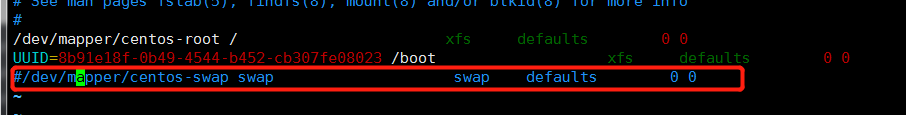

# k8s环境部署

## 注意事项

需要注意版本之间的组件兼容性，k8s在1.24.0版本中，默认弃用docker

## 环境配置

### 1. 关闭seLinux

```shell
setenforce 0
sed -i 's/^SELINUX=enforcing$/SELINUX=disabled/' /etc/selinux/config
```

### 2. 关闭防火墙

```shell
systemctl stop firewalld && systemctl disable firewalld
```

### 3. 禁用swap

```shell
swapoff -a
```

vi /etc/fstab 注释swap行

### 4. 修改内核参数和模块

```shell
cat <<EOF > /etc/sysctl.d/k8s.conf
net.bridge.bridge-nf-call-ip6tables = 1
net.bridge.bridge-nf-call-iptables = 1
EOF
 
# sysctl --system
 
# modprobe br_netfilter
# lsmod | grep br_netfilter
```

### 5. 安装docker

```shell
yum -y install yum-utils device-mapper-persistent-data lvm2
yum-config-manager -y --add-repo https://download.docker.com/linux/centos/docker-ce.repo
yum -y install docker-ce docker-ce-cli containerd.io

systemctl start docker && systemctl enable docker

```

- 更换docker源

  ```shell
  mkdir /etc/docker
  cat <<EOF > /etc/docker/daemon.json
  {
    "registry-mirrors": [
      "http://hub-mirror.c.163.com",
      "https://docker.mirrors.ustc.edu.cn",
      "https://registry.docker-cn.com"
    ]
  }
  EOF
   
  systemctl restart docker
  ```

### 6. 安装k8s

```shell
cat <<EOF > /etc/yum.repos.d/kubernetes.repo
[kubernetes]
name=Kubernetes
baseurl=https://mirrors.aliyun.com/kubernetes/yum/repos/kubernetes-el7-x86_64/
enabled=1
gpgcheck=1
repo_gpgcheck=1
gpgkey=https://mirrors.aliyun.com/kubernetes/yum/doc/yum-key.gpg https://mirrors.aliyun.com/kubernetes/yum/doc/rpm-package-key.gpg
EOF

yum -y install kubelet-1.23* kubeadm-1.23* kubectl-1.23*

systemctl start kubelet && systemctl enable kubelet
```

### 7. 下载k8s相关镜像并打标签

```shell
 # 查看需要的镜像库
 kubeadm config images list
 
 I0110 03:12:17.916722   31199 version.go:255] remote version is much newer: v1.26.0; falling back to: stable-1.23
registry.k8s.io/kube-apiserver:v1.23.15
registry.k8s.io/kube-controller-manager:v1.23.15
registry.k8s.io/kube-scheduler:v1.23.15
registry.k8s.io/kube-proxy:v1.23.15
registry.k8s.io/pause:3.6
registry.k8s.io/etcd:3.5.6-0
registry.k8s.io/coredns/coredns:v1.8.6

#从国内镜像拉取
docker pull registry.cn-hangzhou.aliyuncs.com/google_containers/kube-apiserver:v1.23.15
docker pull registry.cn-hangzhou.aliyuncs.com/google_containers/kube-controller-manager:v1.23.15
docker pull registry.cn-hangzhou.aliyuncs.com/google_containers/kube-scheduler:v1.23.15
docker pull registry.cn-hangzhou.aliyuncs.com/google_containers/kube-proxy:v1.23.15
docker pull registry.cn-hangzhou.aliyuncs.com/google_containers/pause:3.6
docker pull registry.cn-hangzhou.aliyuncs.com/google_containers/etcd:3.5.6-0
docker pull coredns/coredns:1.8.6

#将拉取下来的images重命名为kubeadm config所需的镜像名字
docker tag registry.cn-hangzhou.aliyuncs.com/google_containers/kube-apiserver:v1.23.15 registry.k8s.io/kube-apiserver:v1.23.15
docker tag registry.cn-hangzhou.aliyuncs.com/google_containers/kube-controller-manager:v1.23.15 registry.k8s.io/kube-controller-manager:v1.23.15
docker tag registry.cn-hangzhou.aliyuncs.com/google_containers/kube-scheduler:v1.23.15 registry.k8s.io/kube-scheduler:v1.23.15
docker tag registry.cn-hangzhou.aliyuncs.com/google_containers/kube-proxy:v1.23.15 registry.k8s.io/kube-proxy:v1.23.15
docker tag registry.cn-hangzhou.aliyuncs.com/google_containers/pause:3.6 registry.k8s.io/pause:3.6
docker tag registry.cn-hangzhou.aliyuncs.com/google_containers/etcd:3.5.6-0 registry.k8s.io/etcd:3.5.6-0
docker tag coredns/coredns:1.8.6 registry.k8s.io/coredns/coredns:v1.8.6
```

### 8. 初始化k8s和网络

```shell
# kubeadm init --kubernetes-version=v1.23.15 --pod-network-cidr=10.100.0.0/16
# mkdir -p $HOME/.kube
# sudo cp -i /etc/kubernetes/admin.conf $HOME/.kube/config
# sudo chown $(id -u):$(id -g) $HOME/.kube/config
 
# kubectl apply -f https://cloud.weave.works/k8s/net?k8s-version=$(kubectl version | base64 | tr -d '\n')
```

### 9. 安装k8s-dashboard

```shell
# kubernetesui/dashboard:v2.5.1 对应 k8s 1.23.*

kubectl apply -f https://raw.githubusercontent.com/kubernetes/dashboard/v2.5.1/aio/deploy/recommended.yaml


# recommended.yaml

# Copyright 2017 The Kubernetes Authors.
#
# Licensed under the Apache License, Version 2.0 (the "License");
# you may not use this file except in compliance with the License.
# You may obtain a copy of the License at
#
#     http://www.apache.org/licenses/LICENSE-2.0
#
# Unless required by applicable law or agreed to in writing, software
# distributed under the License is distributed on an "AS IS" BASIS,
# WITHOUT WARRANTIES OR CONDITIONS OF ANY KIND, either express or implied.
# See the License for the specific language governing permissions and
# limitations under the License.

apiVersion: v1
kind: Namespace
metadata:
  name: kubernetes-dashboard

---

apiVersion: v1
kind: ServiceAccount
metadata:
  labels:
    k8s-app: kubernetes-dashboard
  name: kubernetes-dashboard
  namespace: kubernetes-dashboard

---

kind: Service
apiVersion: v1
metadata:
  labels:
    k8s-app: kubernetes-dashboard
  name: kubernetes-dashboard
  namespace: kubernetes-dashboard
spec:
  ports:
    - port: 443
      targetPort: 8443
  selector:
    k8s-app: kubernetes-dashboard

---

apiVersion: v1
kind: Secret
metadata:
  labels:
    k8s-app: kubernetes-dashboard
  name: kubernetes-dashboard-certs
  namespace: kubernetes-dashboard
type: Opaque

---

apiVersion: v1
kind: Secret
metadata:
  labels:
    k8s-app: kubernetes-dashboard
  name: kubernetes-dashboard-csrf
  namespace: kubernetes-dashboard
type: Opaque
data:
  csrf: ""

---

apiVersion: v1
kind: Secret
metadata:
  labels:
    k8s-app: kubernetes-dashboard
  name: kubernetes-dashboard-key-holder
  namespace: kubernetes-dashboard
type: Opaque

---

kind: ConfigMap
apiVersion: v1
metadata:
  labels:
    k8s-app: kubernetes-dashboard
  name: kubernetes-dashboard-settings
  namespace: kubernetes-dashboard

---

kind: Role
apiVersion: rbac.authorization.k8s.io/v1
metadata:
  labels:
    k8s-app: kubernetes-dashboard
  name: kubernetes-dashboard
  namespace: kubernetes-dashboard
rules:
  # Allow Dashboard to get, update and delete Dashboard exclusive secrets.
  - apiGroups: [""]
    resources: ["secrets"]
    resourceNames: ["kubernetes-dashboard-key-holder", "kubernetes-dashboard-certs", "kubernetes-dashboard-csrf"]
    verbs: ["get", "update", "delete"]
    # Allow Dashboard to get and update 'kubernetes-dashboard-settings' config map.
  - apiGroups: [""]
    resources: ["configmaps"]
    resourceNames: ["kubernetes-dashboard-settings"]
    verbs: ["get", "update"]
    # Allow Dashboard to get metrics.
  - apiGroups: [""]
    resources: ["services"]
    resourceNames: ["heapster", "dashboard-metrics-scraper"]
    verbs: ["proxy"]
  - apiGroups: [""]
    resources: ["services/proxy"]
    resourceNames: ["heapster", "http:heapster:", "https:heapster:", "dashboard-metrics-scraper", "http:dashboard-metrics-scraper"]
    verbs: ["get"]

---

kind: ClusterRole
apiVersion: rbac.authorization.k8s.io/v1
metadata:
  labels:
    k8s-app: kubernetes-dashboard
  name: kubernetes-dashboard
rules:
  # Allow Metrics Scraper to get metrics from the Metrics server
  - apiGroups: ["metrics.k8s.io"]
    resources: ["pods", "nodes"]
    verbs: ["get", "list", "watch"]

---

apiVersion: rbac.authorization.k8s.io/v1
kind: RoleBinding
metadata:
  labels:
    k8s-app: kubernetes-dashboard
  name: kubernetes-dashboard
  namespace: kubernetes-dashboard
roleRef:
  apiGroup: rbac.authorization.k8s.io
  kind: Role
  name: kubernetes-dashboard
subjects:
  - kind: ServiceAccount
    name: kubernetes-dashboard
    namespace: kubernetes-dashboard

---

apiVersion: rbac.authorization.k8s.io/v1
kind: ClusterRoleBinding
metadata:
  name: kubernetes-dashboard
roleRef:
  apiGroup: rbac.authorization.k8s.io
  kind: ClusterRole
  name: kubernetes-dashboard
subjects:
  - kind: ServiceAccount
    name: kubernetes-dashboard
    namespace: kubernetes-dashboard

---

kind: Deployment
apiVersion: apps/v1
metadata:
  labels:
    k8s-app: kubernetes-dashboard
  name: kubernetes-dashboard
  namespace: kubernetes-dashboard
spec:
  replicas: 1
  revisionHistoryLimit: 10
  selector:
    matchLabels:
      k8s-app: kubernetes-dashboard
  template:
    metadata:
      labels:
        k8s-app: kubernetes-dashboard
    spec:
      securityContext:
        seccompProfile:
          type: RuntimeDefault
      containers:
        - name: kubernetes-dashboard
          image: kubernetesui/dashboard:v2.5.1
          imagePullPolicy: Always
          ports:
            - containerPort: 8443
              protocol: TCP
          args:
            - --auto-generate-certificates
            - --namespace=kubernetes-dashboard
            # Uncomment the following line to manually specify Kubernetes API server Host
            # If not specified, Dashboard will attempt to auto discover the API server and connect
            # to it. Uncomment only if the default does not work.
            # - --apiserver-host=http://my-address:port
          volumeMounts:
            - name: kubernetes-dashboard-certs
              mountPath: /certs
              # Create on-disk volume to store exec logs
            - mountPath: /tmp
              name: tmp-volume
          livenessProbe:
            httpGet:
              scheme: HTTPS
              path: /
              port: 8443
            initialDelaySeconds: 30
            timeoutSeconds: 30
          securityContext:
            allowPrivilegeEscalation: false
            readOnlyRootFilesystem: true
            runAsUser: 1001
            runAsGroup: 2001
      volumes:
        - name: kubernetes-dashboard-certs
          secret:
            secretName: kubernetes-dashboard-certs
        - name: tmp-volume
          emptyDir: {}
      serviceAccountName: kubernetes-dashboard
      nodeSelector:
        "kubernetes.io/os": linux
      # Comment the following tolerations if Dashboard must not be deployed on master
      tolerations:
        - key: node-role.kubernetes.io/master
          effect: NoSchedule

---

kind: Service
apiVersion: v1
metadata:
  labels:
    k8s-app: dashboard-metrics-scraper
  name: dashboard-metrics-scraper
  namespace: kubernetes-dashboard
spec:
  ports:
    - port: 8000
      targetPort: 8000
  selector:
    k8s-app: dashboard-metrics-scraper

---

kind: Deployment
apiVersion: apps/v1
metadata:
  labels:
    k8s-app: dashboard-metrics-scraper
  name: dashboard-metrics-scraper
  namespace: kubernetes-dashboard
spec:
  replicas: 1
  revisionHistoryLimit: 10
  selector:
    matchLabels:
      k8s-app: dashboard-metrics-scraper
  template:
    metadata:
      labels:
        k8s-app: dashboard-metrics-scraper
    spec:
      securityContext:
        seccompProfile:
          type: RuntimeDefault
      containers:
        - name: dashboard-metrics-scraper
          image: kubernetesui/metrics-scraper:v1.0.7
          ports:
            - containerPort: 8000
              protocol: TCP
          livenessProbe:
            httpGet:
              scheme: HTTP
              path: /
              port: 8000
            initialDelaySeconds: 30
            timeoutSeconds: 30
          volumeMounts:
          - mountPath: /tmp
            name: tmp-volume
          securityContext:
            allowPrivilegeEscalation: false
            readOnlyRootFilesystem: true
            runAsUser: 1001
            runAsGroup: 2001
      serviceAccountName: kubernetes-dashboard
      nodeSelector:
        "kubernetes.io/os": linux
      # Comment the following tolerations if Dashboard must not be deployed on master
      tolerations:
        - key: node-role.kubernetes.io/master
          effect: NoSchedule
      volumes:
        - name: tmp-volume
          emptyDir: {}
```

### 10. 默认k8s的master节点是不能跑pod的业务，需要执行以下命令解除限制

```shell
# kubectl taint nodes --all node-role.kubernetes.io/master-s
kubectl taint node k8s-2 node-role.kubernetes.io/master-
```

### 11. 验证

验证是否部署成功

```shell
kubectl get pods --all-namespaces

```

## 问题解决

1. 执行 `kubeadm init --kubernetes-version=v1.23.15 --pod-network-cidr=10.100.0.0/16`报错

   ```shell
   [init] Using Kubernetes version: v1.23.15
   [preflight] Running pre-flight checks
   [preflight] Pulling images required for setting up a Kubernetes cluster
   [preflight] This might take a minute or two, depending on the speed of your internet connection
   [preflight] You can also perform this action in beforehand using 'kubeadm config images pull'
   [certs] Using certificateDir folder "/etc/kubernetes/pki"
   [certs] Generating "ca" certificate and key
   [certs] Generating "apiserver" certificate and key
   [certs] apiserver serving cert is signed for DNS names [k8s-2 kubernetes kubernetes.default kubernetes.default.svc kubernetes.default.svc.cluster.local] and IPs [10.96.0.1 192.168.109.23]
   [certs] Generating "apiserver-kubelet-client" certificate and key
   [certs] Generating "front-proxy-ca" certificate and key
   [certs] Generating "front-proxy-client" certificate and key
   [certs] Generating "etcd/ca" certificate and key
   [certs] Generating "etcd/server" certificate and key
   [certs] etcd/server serving cert is signed for DNS names [k8s-2 localhost] and IPs [192.168.109.23 127.0.0.1 ::1]
   [certs] Generating "etcd/peer" certificate and key
   [certs] etcd/peer serving cert is signed for DNS names [k8s-2 localhost] and IPs [192.168.109.23 127.0.0.1 ::1]
   [certs] Generating "etcd/healthcheck-client" certificate and key
   [certs] Generating "apiserver-etcd-client" certificate and key
   [certs] Generating "sa" key and public key
   [kubeconfig] Using kubeconfig folder "/etc/kubernetes"
   [kubeconfig] Writing "admin.conf" kubeconfig file
   [kubeconfig] Writing "kubelet.conf" kubeconfig file
   [kubeconfig] Writing "controller-manager.conf" kubeconfig file
   [kubeconfig] Writing "scheduler.conf" kubeconfig file
   [kubelet-start] Writing kubelet environment file with flags to file "/var/lib/kubelet/kubeadm-flags.env"
   [kubelet-start] Writing kubelet configuration to file "/var/lib/kubelet/config.yaml"
   [kubelet-start] Starting the kubelet
   [control-plane] Using manifest folder "/etc/kubernetes/manifests"
   [control-plane] Creating static Pod manifest for "kube-apiserver"
   [control-plane] Creating static Pod manifest for "kube-controller-manager"
   [control-plane] Creating static Pod manifest for "kube-scheduler"
   [etcd] Creating static Pod manifest for local etcd in "/etc/kubernetes/manifests"
   [wait-control-plane] Waiting for the kubelet to boot up the control plane as static Pods from directory "/etc/kubernetes/manifests". This can take up to 4m0s
   [kubelet-check] Initial timeout of 40s passed.
   [kubelet-check] It seems like the kubelet isn't running or healthy.
   [kubelet-check] The HTTP call equal to 'curl -sSL http://localhost:10248/healthz' failed with error: Get "http://localhost:10248/healthz": dial tcp [::1]:10248: connect: connection refused.
   [kubelet-check] It seems like the kubelet isn't running or healthy.
   [kubelet-check] The HTTP call equal to 'curl -sSL http://localhost:10248/healthz' failed with error: Get "http://localhost:10248/healthz": dial tcp [::1]:10248: connect: connection refused.
   [kubelet-check] It seems like the kubelet isn't running or healthy.
   [kubelet-check] The HTTP call equal to 'curl -sSL http://localhost:10248/healthz' failed with error: Get "http://localhost:10248/healthz": dial tcp [::1]:10248: connect: connection refused.
   [kubelet-check] It seems like the kubelet isn't running or healthy.
   [kubelet-check] The HTTP call equal to 'curl -sSL http://localhost:10248/healthz' failed with error: Get "http://localhost:10248/healthz": dial tcp [::1]:10248: connect: connection refused.
   [kubelet-check] It seems like the kubelet isn't running or healthy.
   [kubelet-check] The HTTP call equal to 'curl -sSL http://localhost:10248/healthz' failed with error: Get "http://localhost:10248/healthz": dial tcp [::1]:10248: connect: connection refused.
   
    Unfortunately, an error has occurred:
     timed out waiting for the condition
   
    This error is likely caused by:
     - The kubelet is not running
     - The kubelet is unhealthy due to a misconfiguration of the node in some way (required cgroups disabled)
   
    If you are on a systemd-powered system, you can try to troubleshoot the error with the following commands:
     - 'systemctl status kubelet'
     - 'journalctl -xeu kubelet'
   
    Additionally, a control plane component may have crashed or exited when started by the container runtime.
    To troubleshoot, list all containers using your preferred container runtimes CLI.
   
    Here is one example how you may list all Kubernetes containers running in docker:
     - 'docker ps -a | grep kube | grep -v pause'
     Once you have found the failing container, you can inspect its logs with:
     - 'docker logs CONTAINERID'
   
   error execution phase wait-control-plane: couldn't initialize a Kubernetes cluster
   To see the stack trace of this error execute with --v=5 or higher
   ```

   ```shell
   https://blog.csdn.net/qq_33326449/article/details/119699126
   查看官网介绍为 docker 和 kubelet 服务中的 cgroup 驱动不一致，有两种方法
   方式一：驱动向 docker 看齐
   方式二：驱动为向 kubelet 看齐
   如果docker 不方便重启则统一向 kubelet看齐，并重启对应的服务即可
   
   vim /etc/docker/daemon.json
   {
     "exec-opts": [
       "native.cgroupdriver=systemd"
     ],
     "registry-mirrors": ["https://krfkvsfx.mirror.aliyuncs.com"]
   
   }   
   ```
