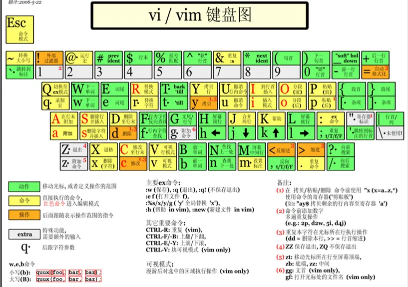

# vim 按键配置指北

## 1. vim三种常用模式介绍

- ### 普通模式(Normal mode)

  在普通模式中，用的编辑器命令，比如移动光标，删除文本等等。这也是Vim启动后的默认模式。

- ###  插入模式(Insert mode)

  在这个模式中，大多数按键都会向文本缓冲中插入文本。大多数新用户希望文本编辑器编辑过程中一直保持这个模式。在插入模式中，可以按`ESC`键回到普通模式。

- ### 命令行模式(Command line mode)

  在命令行模式中可以输入会被解释成并执行的文本。例如执行命令（:键），搜索（/和?键）或者过滤命令（!键）。在命令执行之后，Vim返回到命令行模式之前的模式，通常是普通模式。

|    说明    | 快捷键 |
| :--------: | :----: |
|  普通模式  |  ESC   |
|  插入模式  |  i或a  |
| 命令行模式 |   ：   |

## 2. 按键说明

|       说明       |  快捷键  |
| :--------------: | :------: |
|       左移       |    h     |
|       右移       | l(小写L) |
|       上移       |    k     |
|       下移       |    j     |
| 移动到下一个单词 |    w     |
| 移动到上一个单词 |    b     |

## 3. 插入模式

在普通模式下使用下面的键将进入插入模式，并可以从相应的位置开始输入

|                说明                |  快捷键  |
| :--------------------------------: | :------: |
|        在当前光标处进行编辑        |    i     |
|             在行首插入             | I(大写i) |
|             在行末插入             |    A     |
|          在光标后插入编辑          |    a     |
|       在当前行后插入一个新行       | o(小写)  |
|       在当前行前插入一个新行       | O(大写)  |
| 替换从光标所在位置后到一个单词结尾 |    cw    |

## 4. 退出vim

|       说明       |          快捷键          | 备注                                     |
| :--------------: | :----------------------: | ---------------------------------------- |
|       退出       |            :q            |                                          |
| 强制退出，不保存 |           :q!            |                                          |
|  强制保存并退出  |           :wq!           |                                          |
|      另存为      | :w filepath/new_filename | 1,3 w FileName (保存1~3行内容为指定文件) |
|      另存为      |     :saveas 文件路径     |                                          |
|    保存并退出    |            :x            |                                          |
|    保存并退出    |           :wq            |                                          |
|     退出保存     |         shift+zz         |                                          |

## 5. 保存文本

|          说明          |     快捷键      |
| :--------------------: | :-------------: |
|          保存          |       :w        |
| 将文件另存为其他文件名 | :w new_filename |

## 6.删除文本

|      说明       |  快捷键   |
| :-------------: | :-------: |
|  删除当前字符   | x或Delete |
| 删除前一个字符  |     X     |
|    删除整行     |    dd     |
|  删除一个单词   |  dw或daw  |
|   删除至行尾    |   d$或D   |
|   删除至行首    |    d^     |
| 删除到文档末尾  |    dG     |
| 删除至文档首部  |    d1G    |
|     删除n行     |    ndd    |
| 删除n个连续字符 |    nx     |
|   删除n个单词   |    dnw    |

## 7. 行间跳转

|            说明            | 快捷键 |
| :------------------------: | :----: |
|      移动游标到第n行       |   nG   |
|      移动游标到第一行      |   gg   |
|     移动游标到最后一行     |   G    |
| 快速回到上一次光标所在位置 | Ctrl+o |

## 8. 行内跳转

|                  说明                  | 快捷键  |
| :------------------------------------: | :-----: |
|           到下一个单词的开头           |    w    |
|            到当前单词的结尾            |    e    |
|           到前一个单词的开头           |    b    |
|                 到行首                 |  ^或0   |
|           到前一个单词的结尾           |   ge    |
|                 到行尾                 |    $    |
| 向后搜索<字母>并跳转到第一个匹配的位置 | f<字母> |
| 向前搜索<字母>并跳转到第一个匹配的位置 | F<字母> |

## 9.大小写

|               说明               | 快捷键 |
| :------------------------------: | :----: |
| 将游标所在位置字母变成大写或小写 |   ~    |

## 10.复制及粘贴文本

|             说明             |       快捷键       |
| :--------------------------: | :----------------: |
|      复制游标所在的整行      | yy(3yy表示复制3行) |
| 复制到行首，不含光标所在位置 |       y^或y0       |
|  复制到行尾，含光标所在字符  |         y$         |
|         复制一个单词         |         yw         |
|         复制两个单词         |        y2w         |
|         复制至文本末         |         yG         |
|        复制至文本开头        |        y1G         |
|       粘贴至光标后(下)       |      p(小写)       |
|       粘贴至光标亲(上)       |      P(大写)       |

## 11.剪切

|    说明    | 快捷键 |
| :--------: | :----: |
|    剪切    |   dd   |
| 交换上下行 |  ddp   |

## 12.替换和撤销

|                    说明                    |     快捷键     |
| :----------------------------------------: | :------------: |
|        将游标所在字母替换成指定字母        | r+<待替换字母> |
|           连续替换，直到按下ESC            |       R        |
|  替换整行，即删除游标所在行并进入插入模式  |       cc       |
| 替换一个单词，即删除一个单词并进入插入模式 |       cw       |
|              替换游标后至末尾              |    C(大写)     |
|             撤销一次或n次操作              |      u{n}      |
|            撤销当前行的所有修改            |    U(大写)     |
|            redo,撤销undo的操作             |     Ctrl+r     |

## 13.快速缩进

|             说明             |       快捷键       |
| :--------------------------: | :----------------: |
|        整行将向右缩进        |         >>         |
|        整行将向左退回        |         <<         |
|      设置缩进为10个字符      | :set shiftwidth=10 |
| 获取当前控制缩进和回退字符数 |  :set shiftwidth?  |
|        使本行内容居中        |        :ce         |
|        使本行文本靠右        |        :ri         |
|        使本行内容靠左        |        :le         |

## 14.查找

|          说明          |   快捷键   |        备注         |
| :--------------------: | :--------: | :-----------------: |
|    向下查找<字符串>    | \<字符串>  | 输入n继续查找下一个 |
|    向上查找<字符串>    | ? <字符串> | 输入N继续查找下一个 |
|  寻找游标所在处的单词  |     \*     |        向后         |
|  寻找游标所在处的单词  |     \#     |        向前         |
| 查找部分符合该单词即可 |    g\*     |        向后         |
| 查找部分符合该单词即可 |    g\#     |        向前         |
|        取消搜索        | :noh+Enter |                     |

## 15.恢复文件

如果因为断电等原因造成文档没有保存，可以采用恢复方式，**vim -r**进入文档后，输入**:ewcover 1.txt**来恢复

## 16.文档加密

```shell
$ vim -x file1
```

输入密码 确认密码这样在下一次打开时，vim就会要求你输入密码

## 17.多文件编辑

### 17.多文件编辑

编辑多个文件有两种形式，一种是在进入vim前使用的参数就是多个文件。另一种就是进入vim后再编辑其他的文件。

- 同时创建两个新文件并编辑

  ```shell
  vim 1.txt 2.txt
  ```

- 默认进入1.txt文件的编辑界面

  > 命令行模式下输入 【**:n**】编辑2.txt文件，可以加!即:n!强制切换，之前一个文件的输入没有保存，仅仅切换到另一个文件
  >
  > 命令行模式下输入【**:N**】编辑1.txt文件，可以加!即:N!强制切换，之前文件内的输入没有保存，仅仅是切换到另一个文件

## 18.进入vim后打开新文件

- 命令行模式下输入 **:e 3.txt** 打开新文件3.txt
- 命令行模式下输入 **:e#**  回到前一个文件
- 命令行模式下输入 **:ls**  可以列出以前编辑过的文档
- 命令行模式下输入 **:b 2.txt（或者编号）** 可以直接进入文件2.txt编辑
- 命令行模式下输入 **:bd 2.txt（或者编号）** 可以删除以前编辑过的列表中的文件项目
- 命令行模式下输入 **:e! 4.txt** ，新打开文件4.txt，放弃正在编辑的文件
- 命令行模式下输入 **:f** 显示正在编辑的文件名
- 命令行模式下输入 **:f new.txt**，改变正在编辑的文件名字为new.txt

## 19.查看帮助

- 普通模式下按**F1**打开vim自己预设的帮助文档
- 命令行模式下输入 **:h shiftwidth** 打开名为shiftwidth的帮助文件
- 命令行模式下输入 **:ver** 显示版本及参数

## 20.功能设定

- vim的功能设定
可以在编辑文件的时候进行功能设定，如命令行模式下输入 **:set nu**（显示行数），设定值退出vim后不会保存。要永久保存配置需要修改vim配置文件。 vim的配置文件 **~/.vimrc**，可以打开文件进行修改，不过务必小心不要影响vim正常使用

- 获取目前的设定

  > 命令行模式下输入:set或者:se显示所有修改过的配置
  >
  > 命令行模式下输入:set all 显示所有的设定值
  >
  > 命令行模式下输入:set option? 显示option的设定值
  >
  > 命令行模式下输入:set nooption 取消当期设定值

- set功能的说明

  > 命令行模式下输入:set autoindent(ai) 设置自动缩进
  >
  > 命令行模式下输入:set autowrite(aw)
  >
  > 设置自动存档，默认未打开
  >
  > 命令行模式下输入:set background=dark或light，设置背景风格
  >
  > 命令行模式下输入:set backup(bk) 设置自动备份，默认未打开
  >
  > 命令行模式下输入: set cindent(cin) 设置C语言风格缩进

## 21. vim 键盘图


