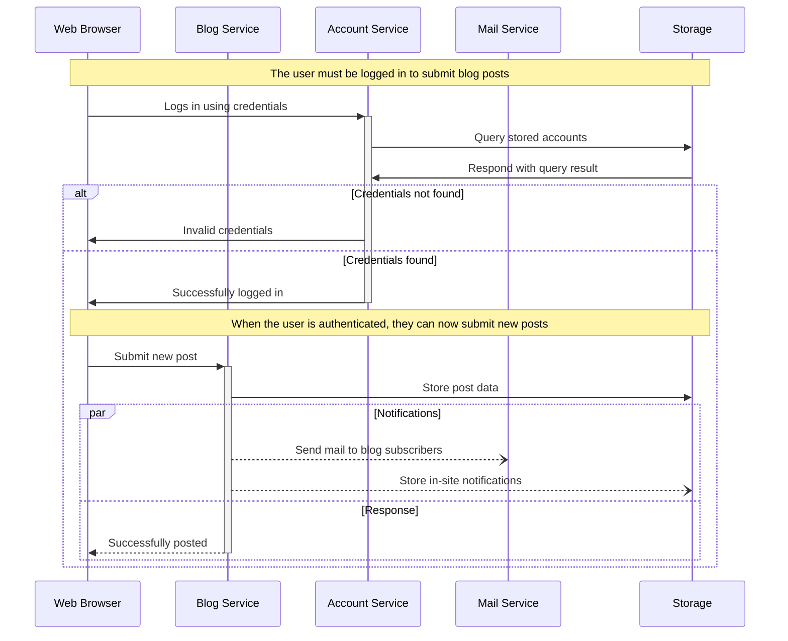
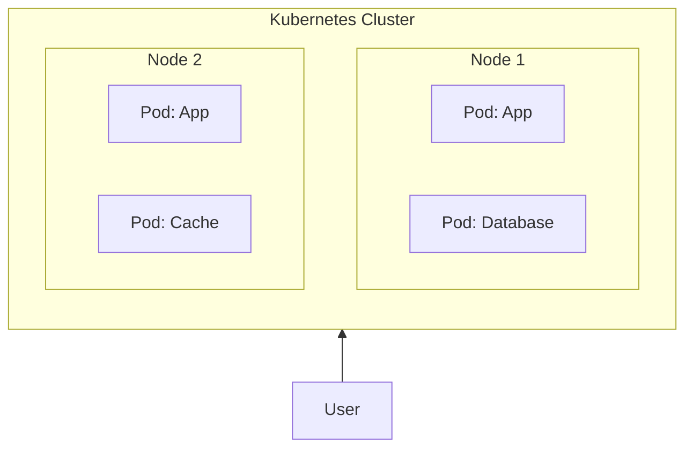

```mermaid
sequenceDiagram
    participant web as Web Browser
    participant blog as Blog Service
    participant account as Account Service
    participant mail as Mail Service
    participant db as Storage

    Note over web,db: The user must be logged in to submit blog posts
    web->>+account: Logs in using credentials
    account->>db: Query stored accounts
    db->>account: Respond with query result

    alt Credentials not found
        account->>web: Invalid credentials
    else Credentials found
        account->>-web: Successfully logged in

        Note over web,db: When the user is authenticated, they can now submit new posts
        web->>+blog: Submit new post
        blog->>db: Store post data

        par Notifications
            blog--)mail: Send mail to blog subscribers
            blog--)db: Store in-site notifications
        and Response
            blog-->>-web: Successfully posted
        end
    end
```

```mermaid
graph BT
    subgraph K8sCluster [Kubernetes Cluster]
        subgraph Node1 [Node 1]
            Pod1[Pod: App]
            Pod2[Pod: Database]
        end
        subgraph Node2 [Node 2]
            Pod3[Pod: App]
            Pod4[Pod: Cache]
        end
    end
    User --> K8sCluster
```

