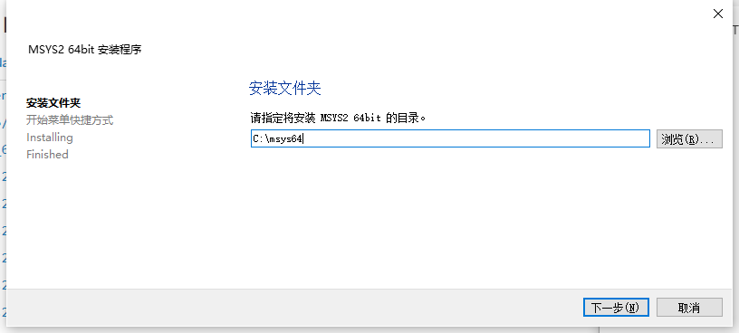
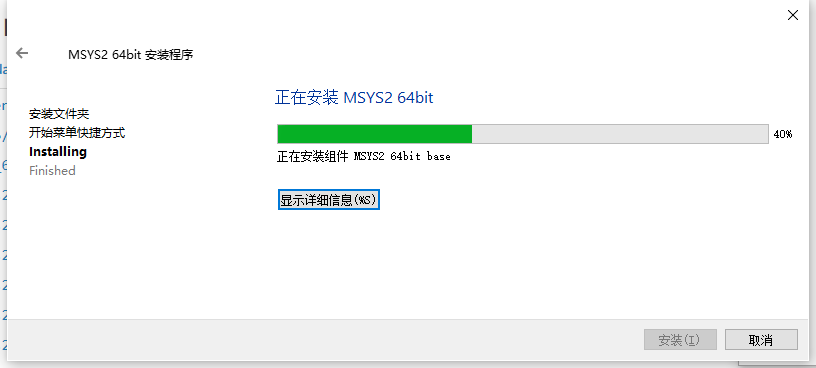
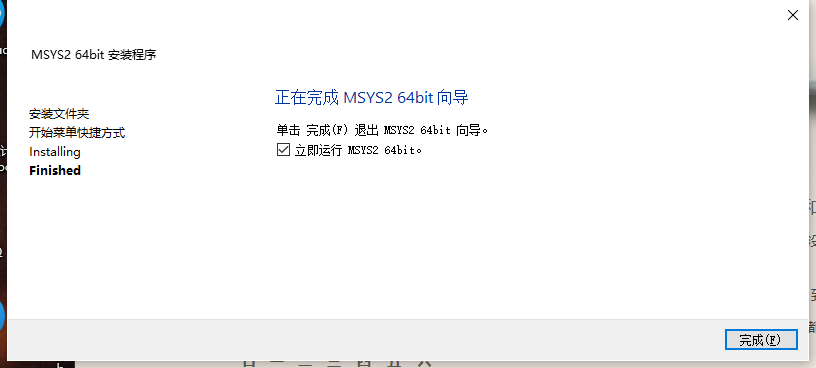

# msys2 环境搭建


## 1. 下载安装包

[Index of /msys2/distrib/ | 清华大学开源软件镜像站 | Tsinghua Open Source Mirror](https://mirrors.tuna.tsinghua.edu.cn/msys2/distrib/)

## 2. 安装

### 2.1 安装过程









## 3. 配置

### 3.1 换源

### 3.2 安装软件

#### 3.2.1 安装 GTK3

```shell
pacman -S mingw-w64-x86_64-gtk3
```

#### 3.2.2 安装GTK2

```shell
pacman -S mingw-w64-x86_64-gtk2
```

#### 3.2.3 安装glade

```shell
pacman -S mingw-w64-x86_64-glade
```

#### 3.2.4 安装 spice-gtk

```shell
pacman -S mingw-w64-x86_64-spice-gtk
```

#### 3.2.5 安装pkg-config

```shell
pacman -S pkg-config
```

#### 3.2.6 安装 icoutils

```
pacman -S mingw-w64-x86_64-icoutils
```

#### 3.2.7 安装 Glib

```
pacman -S mingw-w64-x86_64-pkg-config

pacman -S intltool

pacman -S gcc

pacman -S autoconf

pacman -S automake

pacman -S git-core
```

#### 3.2.8 更新核心库

```
pacman -Syu
```

