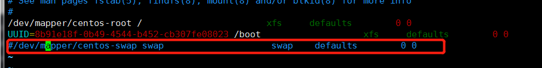

# k8s环境部署

## 注意事项

需要注意版本之间的组件兼容性，k8s在1.24.0版本中，默认弃用docker


## 环境配置

### 1. 关闭seLinux

```shell
setenforce 0
sed -i 's/^SELINUX=enforcing$/SELINUX=disabled/' /etc/selinux/config
```

### 2. 关闭防火墙

```shell
systemctl stop firewalld && systemctl disable firewalld
```

### 3. 禁用swap

```shell
swapoff -a


```

vi /etc/fstab 注释swap行

### 4. 修改内核参数和模块

```shell
cat <<EOF > /etc/sysctl.d/k8s.conf
net.bridge.bridge-nf-call-ip6tables = 1
net.bridge.bridge-nf-call-iptables = 1
EOF
 
# sysctl --system
 
# modprobe br_netfilter
# lsmod | grep br_netfilter
```

### 5. 安装docker

```shell
yum -y install yum-utils device-mapper-persistent-data lvm2
yum-config-manager -y --add-repo https://download.docker.com/linux/centos/docker-ce.repo
yum -y install docker-ce docker-ce-cli containerd.io

systemctl start docker && systemctl enable docker

```

- 更换docker源

  ```shell
  mkdir /etc/docker
  cat <<EOF > /etc/docker/daemon.json
  {
    "registry-mirrors": [
      "http://hub-mirror.c.163.com",
      "https://docker.mirrors.ustc.edu.cn",
      "https://registry.docker-cn.com"
    ]
  }
  EOF
   
  systemctl restart docker
  ```

### 6. 安装k8s

```shell
cat <<EOF > /etc/yum.repos.d/kubernetes.repo
[kubernetes]
name=Kubernetes
baseurl=https://mirrors.aliyun.com/kubernetes/yum/repos/kubernetes-el7-x86_64/
enabled=1
gpgcheck=1
repo_gpgcheck=1
gpgkey=https://mirrors.aliyun.com/kubernetes/yum/doc/yum-key.gpg https://mirrors.aliyun.com/kubernetes/yum/doc/rpm-package-key.gpg
EOF

yum -y install kubelet-1.23* kubeadm-1.23* kubectl-1.23*

systemctl start kubelet && systemctl enable kubelet
```

### 7. 下载k8s相关镜像并打标签

```shell
# 不能正常使用
# docker pull mirrorgooglecontainers/kube-apiserver:v1.13.3
# docker pull mirrorgooglecontainers/kube-controller-manager:v1.13.3
# docker pull mirrorgooglecontainers/kube-scheduler:v1.13.3
# docker pull mirrorgooglecontainers/kube-proxy:v1.13.3
# docker pull mirrorgooglecontainers/pause:3.1
# docker pull mirrorgooglecontainers/etcd:3.2.24
# docker pull coredns/coredns:1.2.6
 
# docker tag mirrorgooglecontainers/kube-apiserver:v1.13.3 k8s.gcr.io/kube-apiserver:v1.13.3
# docker tag mirrorgooglecontainers/kube-controller-manager:v1.13.3 k8s.gcr.io/kube-controller-manager:v1.13.3
# docker tag mirrorgooglecontainers/kube-scheduler:v1.13.3 k8s.gcr.io/kube-scheduler:v1.13.3
# docker tag mirrorgooglecontainers/kube-proxy:v1.13.3 k8s.gcr.io/kube-proxy:v1.13.3
# docker tag mirrorgooglecontainers/pause:3.1 k8s.gcr.io/pause:3.1
# docker tag mirrorgooglecontainers/etcd:3.2.24 k8s.gcr.io/etcd:3.2.24
# docker tag coredns/coredns:1.2.6 k8s.gcr.io/coredns:1.2.6
```

### 8. 初始化k8s和网络

```shell
# kubeadm init --kubernetes-version=v1.23.15 --pod-network-cidr=10.100.0.0/16
# mkdir -p $HOME/.kube
# sudo cp -i /etc/kubernetes/admin.conf $HOME/.kube/config
# sudo chown $(id -u):$(id -g) $HOME/.kube/config
 
# kubectl apply -f https://cloud.weave.works/k8s/net?k8s-version=$(kubectl version | base64 | tr -d '\n')
```

### 9. 默认k8s的master节点是不能跑pod的业务，需要执行以下命令解除限制

```shell
# kubectl taint node kube-master node-role.kubernetes.io/master-
```

### 10. 验证

验证是否部署成功

```shell
kubectl get pods --all-namespaces

```
