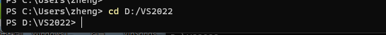
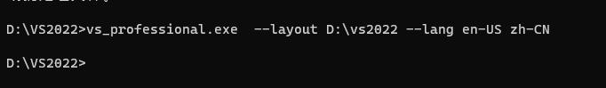

# virtual studio 2022 离线安装

## 安装准备

1. 在D盘创建`VS2022`文件夹 

2. 在VS官网下载 需要使用的版本 [Visual Studio 2022 IDE - 适用于软件开发人员的编程工具 (microsoft.com)](https://visualstudio.microsoft.com/zh-hans/vs/)

3. 打开 终端，输入命令 ` cd D:/VS2022`

   

4. 输入如下命令 `vs_professional.exe  --layout D:\vs2022 --lang en-US zh-CN`



```powershell
vs_enterprise.exe --layout c:\localVScache --lang zh-CN

# 创建后更新
vs_enterprise.exe --layout c:\localVScache  --useLatestInstaller

# 删除更新后的旧版本
vs_enterprise.exe --layout c:\localVScache  --clean c:\localVScache\Archive\1cd70189-fc55-4583-8ad8-a2711e928325\Catalog.json

# 验证文件
vs_enterprise.exe --layout c:\localVScache --verify
# 修复文件
vs_enterprise.exe --layout c:\localVScache --fix


# 安装
vs_enterprise.exe --noweb
```

